# Intelligent Document Processor - Architecture Documentation
**Stack:** SimplifiedDocProcessorStackV3  
**Last Updated:** November 12, 2025  
**Based On:** Actual deployed CloudFormation template

---

## Table of Contents

- [System Overview](#system-overview)
- [Complete System Architecture](#complete-system-architecture)
- [Component Details](#component-details)
- [Step Functions Workflow](#step-functions-workflow)
- [API Architecture](#api-architecture)
- [Data Storage Architecture](#data-storage-architecture)
- [Frontend Architecture](#frontend-architecture)
- [Security Architecture](#security-architecture)
- [Monitoring & Observability](#monitoring--observability)
- [Disaster Recovery](#disaster-recovery)
- [Cost Optimization](#cost-optimization)

---

## System Overview

The Intelligent Document Processor is a **serverless AWS application** that processes documents uploaded to S3 using **Step Functions** to orchestrate a multi-stage pipeline involving Textract, Comprehend, and Bedrock.

### Key Technologies

- **Orchestration**: AWS Step Functions State Machine
- **Compute**: AWS Lambda (8 functions, Node.js 20.x)
- **Storage**: Amazon S3 (KMS encrypted, versioned)
- **Database**: Amazon DynamoDB Global Tables (3 tables with DR replication)
- **Authentication**: Amazon Cognito User Pool
- **Frontend**: React app hosted on S3 + CloudFront
- **API**: Amazon API Gateway with Cognito authorizer
- **Security**: AWS KMS, IAM, CloudTrail
- **Monitoring**: CloudWatch Logs, Metrics, Dashboard, Alarms

**Cost Estimate:** ~$50-70/month for moderate usage (see [Cost Optimization](#cost-optimization))

---

## Complete System Architecture

```mermaid
graph TB
    subgraph "Client Layer"
        User[👤 User]
        Browser[Web Browser]
    end

    subgraph "CDN & Frontend"
        CF[☁️ CloudFront<br/>Distribution]
        S3Web[📦 S3 Frontend Bucket<br/>React Static Site]
    end

    subgraph "Authentication"
        Cognito[🔐 Cognito User Pool<br/>idp-901916-uswe<br/>Admin Create Only]
        CogAuth[🔒 Cognito Authorizer]
    end

    subgraph "API Layer"
        APIGW[🌐 API Gateway<br/>REST API<br/>Throttle: 100 req/s]
        subgraph "API Lambdas"
            UploadLambda[λ Upload Handler<br/>30s timeout<br/>Presigned URLs]
            SearchLambda[λ Search Handler<br/>30s timeout<br/>Query DynamoDB]
        end
    end

    subgraph "Document Storage"
        S3Docs[📦 S3 Documents Bucket<br/>KMS Encrypted<br/>Versioned<br/>EventBridge Enabled<br/>Lifecycle: 30d→IA→90d→Glacier→365d→DeepArchive]
        KMS1[🔑 KMS Key<br/>Customer Managed<br/>Auto-rotation]
    end

    subgraph "Event Processing"
        EB[⚡ EventBridge<br/>S3 Event Router<br/>Object Created]
        SFN[🔄 Step Functions<br/>State Machine<br/>doc-processing-us-west-2<br/>30min timeout]
    end

    subgraph "Processing Lambdas"
        L1[λ Duplicate Check<br/>60s timeout<br/>SHA-256 Hashing]
        L2[λ Textract Start<br/>30s timeout<br/>Async Job Init]
        L3[λ Textract Status<br/>30s timeout<br/>Job Polling]
        L4[λ Comprehend Analyze<br/>30s timeout<br/>Language & Entities]
        L5[λ Bedrock Summarize<br/>45s timeout<br/>Claude Sonnet 3]
        L6[λ Store Metadata<br/>30s timeout<br/>DynamoDB Write]
    end

    subgraph "AWS AI Services"
        Textract[📄 Amazon Textract<br/>Text Extraction<br/>OCR<br/>Async Jobs]
        Comprehend[🔍 Amazon Comprehend<br/>NLP<br/>Language Detection<br/>Entity Extraction<br/>Key Phrases]
        Bedrock[🤖 Amazon Bedrock<br/>Claude Sonnet 3<br/>Summarization<br/>Insights Extraction]
    end

    subgraph "Data Layer - Primary Region us-west-2"
        DDB1[(💾 DynamoDB Global Table<br/>document-metadata<br/>PK: documentId<br/>SK: processingDate)]
        DDB2[(💾 DynamoDB Global Table<br/>document-names<br/>PK: documentId<br/>GSI: S3KeyIndex)]
        Hash1[(💾 DynamoDB Global Table<br/>document-hash-registry<br/>PK: contentHash<br/>Duplicate Detection)]
        GSI1[📊 GSI: LanguageIndex<br/>language + processingDate]
    end

    subgraph "Data Layer - DR Region us-east-2"
        DDB1_DR[(💾 DynamoDB Replica<br/>document-metadata<br/>Auto-sync<br/>Deletion Protected)]
        DDB2_DR[(💾 DynamoDB Replica<br/>document-names<br/>Auto-sync<br/>Deletion Protected)]
        Hash1_DR[(💾 DynamoDB Replica<br/>hash-registry<br/>Auto-sync<br/>Deletion Protected)]
    end

    subgraph "Monitoring & Error Handling"
        CW[📊 CloudWatch<br/>Logs & Metrics]
        CWDash[📈 CloudWatch Dashboard<br/>Visualization]
        Alarms[🚨 CloudWatch Alarms<br/>DLQ + Workflow Failures]
        DLQ[📮 SQS Dead Letter Queue<br/>Failed Jobs<br/>14-day retention<br/>KMS Encrypted]
        SNS[📧 SNS Topic<br/>Email/SMS Alerts<br/>doc-processing-alerts]
        Trail[📋 CloudTrail<br/>Audit Logging]
    end

    User -->|HTTPS| Browser
    Browser -->|Request| CF
    CF -->|Serve Static| S3Web
    Browser -->|Sign In| Cognito
    Cognito -->|ID Token| Browser
    Browser -->|API Call + Token| APIGW
    APIGW -->|Verify Token| CogAuth
    CogAuth -->|Validate| Cognito
    
    APIGW -->|POST /upload| UploadLambda
    APIGW -->|GET /search| SearchLambda
    APIGW -->|GET /metadata| SearchLambda
    APIGW -->|GET /health| SearchLambda
    
    UploadLambda -->|Generate Presigned URL| S3Docs
    UploadLambda -->|Store Name Mapping| DDB2
    SearchLambda -->|Query| DDB1
    SearchLambda -->|Query| DDB2
    
    Browser -->|PUT to Presigned URL| S3Docs
    S3Docs -.->|Encrypted with| KMS1
    S3Docs -->|Object Created Event| EB
    EB -->|Trigger| SFN
    
    SFN -->|1. Check Duplicate| L1
    L1 -->|Check/Store Hash| Hash1
    L1 -.->|If Duplicate| L6
    L1 -->|If New| L2
    
    L2 -->|StartDocumentTextDetection| Textract
    SFN -->|Wait 10s| L3
    L3 -->|GetDocumentTextDetection| Textract
    L3 -->|Loop if IN_PROGRESS| L3
    L3 -->|Text Extracted| L4
    
    L4 -->|DetectDominantLanguage| Comprehend
    L4 -->|DetectEntities| Comprehend
    L4 -->|DetectKeyPhrases| Comprehend
    L4 -->|Results| L5
    
    L5 -->|InvokeModel| Bedrock
    L5 -->|Summary + Insights| L6
    
    L6 -->|PutItem| DDB1
    L6 -->|Query Name| DDB2
    
    DDB1 -->|Use Index| GSI1
    DDB1 -.->|Replicate| DDB1_DR
    DDB2 -.->|Replicate| DDB2_DR
    Hash1 -.->|Replicate| Hash1_DR
    
    SFN -->|On Error| DLQ
    L1 -->|On Error| DLQ
    L2 -->|On Error| DLQ
    L3 -->|On Error| DLQ
    L4 -->|On Error| DLQ
    L5 -->|On Error| DLQ
    L6 -->|On Error| DLQ
    
    DLQ -->|Messages Visible| Alarms
    Alarms -->|Trigger| SNS
    
    SFN -->|Execution Logs| CW
    L1 -->|Logs| CW
    L2 -->|Logs| CW
    L3 -->|Logs| CW
    L4 -->|Logs| CW
    L5 -->|Logs| CW
    L6 -->|Logs| CW
    UploadLambda -->|Logs| CW
    SearchLambda -->|Logs| CW
    APIGW -->|Logs| CW
    
    CW -->|Aggregate| CWDash
    CW -->|Evaluate| Alarms
    Trail -->|Audit| CW

    style User fill:#e1f5ff
    style S3Docs fill:#ff9900
    style S3Web fill:#ff9900
    style SFN fill:#e7157b
    style DDB1 fill:#527fff
    style DDB2 fill:#527fff
    style Hash1 fill:#527fff
    style DDB1_DR fill:#527fff
    style DDB2_DR fill:#527fff
    style Hash1_DR fill:#527fff
    style Textract fill:#ff9900
    style Comprehend fill:#ff9900
    style Bedrock fill:#ff9900
    style DLQ fill:#ff6b6b
    style Cognito fill:#dd344c
    style CF fill:#8C4FFF
```



---

## Component Details

### Lambda Functions (8 Total)

```mermaid
graph LR
    subgraph "API Functions (2)"
        Upload[λ Upload Handler<br/>doc-upload-us-west-2<br/>30s timeout<br/>Generate presigned URLs<br/>Store name mappings]
        Search[λ Search Handler<br/>doc-search-us-west-2<br/>30s timeout<br/>DynamoDB queries<br/>Metadata retrieval]
    end

    subgraph "Processing Functions (6)"
        DupCheck[λ Duplicate Check<br/>doc-duplicate-check-us-west-2<br/>60s timeout<br/>SHA-256 hashing]
        TextStart[λ Textract Start<br/>doc-textract-start-us-west-2<br/>30s timeout<br/>Async job init]
        TextStatus[λ Textract Status<br/>doc-textract-status-us-west-2<br/>30s timeout<br/>Job polling]
        Comp[λ Comprehend Analyze<br/>doc-comprehend-us-west-2<br/>30s timeout<br/>NLP analysis]
        BR[λ Bedrock Summarize<br/>doc-bedrock-us-west-2<br/>45s timeout<br/>AI enrichment<br/>Claude Sonnet 3]
        Store[λ Store Metadata<br/>doc-store-us-west-2<br/>30s timeout<br/>DynamoDB write]
    end

    subgraph "Environment Variables"
        ENV1[DOCUMENTS_BUCKET<br/>KMS_KEY_ARN<br/>DOCUMENT_NAME_TABLE]
        ENV2[METADATA_TABLE_NAME<br/>DOCUMENT_NAME_TABLE]
        ENV3[HASH_TABLE_NAME]
        ENV4[BEDROCK_MODEL_ID<br/>Claude Sonnet 3]
    end

    Upload -.->|Uses| ENV1
    Search -.->|Uses| ENV2
    DupCheck -.->|Uses| ENV3
    BR -.->|Uses| ENV4

    style Upload fill:#90EE90
    style Search fill:#90EE90
    style DupCheck fill:#87CEEB
    style TextStart fill:#87CEEB
    style TextStatus fill:#87CEEB
    style Comp fill:#87CEEB
    style BR fill:#87CEEB
    style Store fill:#87CEEB
```



**Key Details:**
- **Runtime**: Node.js 20.x
- **Log Retention**: 90 days
- **Dead Letter Queue**: Attached to all functions
- **Retry Logic**: Configured in Step Functions (3 attempts, exponential backoff)

---

## Step Functions Workflow

### State Machine Definition


### Error Handling & Retry Logic

**Each Lambda in the state machine has:**
- **Retry Attempts**: 6
- **Backoff Rate**: 2x
- **Interval**: 2 seconds
- **Retryable Errors**: 
  - `Lambda.ClientExecutionTimeoutException`
  - `Lambda.ServiceException`
  - `Lambda.AWSLambdaException`
  - `Lambda.SdkClientException`

**Timeout**: 30 minutes (1800 seconds) for entire state machine

---

## API Architecture

### API Gateway Endpoints

| Endpoint | Method | Auth | Lambda Handler | Purpose |
|----------|--------|------|----------------|---------|
| `/upload` | POST | Cognito | Upload Handler | Generate presigned S3 URL |
| `/search` | GET | Cognito | Search Handler | Search documents by filters |
| `/search` | POST | Cognito | Search Handler | Search with complex filters |
| `/metadata` | GET | Cognito | Search Handler | Get document metadata |
| `/health` | GET | IAM | Search Handler | Health check endpoint |

### Authentication Flow


**Cognito Configuration:**
- **User Pool**: doc-processor-users-us-west-2
- **Domain**: idp-901916-uswe
- **Client**: doc-processor-frontend-us-west-2
- **Admin Create Only**: True (no self-registration)
- **OAuth Flows**: Authorization code
- **OAuth Scopes**: email, openid, profile
- **Password Policy**: Min 8 chars, uppercase, lowercase, numbers required

---

## Data Storage Architecture

### DynamoDB Global Tables (3 Tables)

#### 1. Document Metadata Table
**Name**: `document-metadata-uswest2-df3261d7`

```mermaid
erDiagram
    METADATA_TABLE {
        string documentId PK "Format: bucket/key"
        string processingDate SK "ISO 8601 timestamp"
        string s3Bucket
        string s3Key
        string language "Detected by Comprehend"
        string entities "JSON array"
        string keyPhrases "JSON array"
        string text "First 10k characters"
        number fullTextLength
        string summary "Bedrock-generated"
        string insights "Bedrock-extracted"
        string structuredData "JSON object"
        string status "PROCESSED | DUPLICATE"
        string duplicateOf "Optional - original documentId"
        string contentHash "SHA-256"
    }

    LANGUAGE_INDEX {
        string language PK "GSI PK"
        string processingDate SK "GSI SK"
        string documentId "Projected"
    }

    METADATA_TABLE ||--o{ LANGUAGE_INDEX : "GSI"
```

**Configuration:**
- **Billing Mode**: Pay-per-request (on-demand)
- **Replication**: us-west-2 (primary), us-east-2 (DR)
- **Point-in-Time Recovery**: Enabled
- **Deletion Protection**: Enabled (DR region)
- **Stream**: NEW_AND_OLD_IMAGES

#### 2. Document Names Table
**Name**: `document-names-uswest2-546db246`


**Purpose**: Map friendly document IDs to S3 keys and original filenames

#### 3. Hash Registry Table
**Name**: `document-hash-registry-uswest2-b2e970e1`


**Purpose**: Duplicate detection via content hashing

---

## Frontend Architecture

### CloudFront + S3 Static Hosting

```mermaid
graph TB
    subgraph "User Device"
        Browser[Web Browser<br/>React SPA]
    end

    subgraph "AWS CloudFront"
        CF[CloudFront Distribution<br/>HTTPS Only<br/>HTTP/2 Enabled]
        OAC[Origin Access Control<br/>S3 Origin]
        Cache[Cache Policy<br/>CachingOptimized]
    end

    subgraph "S3 Frontend Bucket"
        S3Frontend[S3 Bucket<br/>doc-processor-frontend<br/>Static Website<br/>KMS Encrypted]
        Files[index.html<br/>bundle.js<br/>config.json<br/>CSS/Assets]
    end

    subgraph "Configuration"
        Config[config.json<br/>- API Endpoint<br/>- Cognito Pool ID<br/>- Cognito Client ID<br/>- Cognito Domain<br/>- CloudFront URL]
    end

    Browser -->|HTTPS Request| CF
    CF -->|Check Cache| Cache
    Cache -->|Cache Miss| OAC
    OAC -->|Fetch| S3Frontend
    S3Frontend -->|Serve| Files
    Files -->|Contains| Config
    CF -->|HTTPS Response| Browser

    Browser -.->|Error 404/403| CF
    CF -.->|Return| S3Frontend
    S3Frontend -.->|Serve| Files
    note right of S3Frontend: SPA routing<br/>Always return index.html

    style Browser fill:#e1f5ff
    style CF fill:#8C4FFF
    style S3Frontend fill:#ff9900
```

**CloudFront Configuration:**
- **Price Class**: PriceClass_100 (US, Canada, Europe)
- **Compression**: Enabled
- **IPv6**: Enabled
- **Default Root Object**: index.html
- **Custom Error Responses**:
  - 404 → index.html (for SPA routing)
  - 403 → index.html (for SPA routing)

**Frontend Features:**
- React SPA with visualization dashboard
- Cognito authentication integration
- File upload with presigned URLs
- Document search and filtering
- Metadata viewer
- Processing status indicators

---

## Security Architecture

### Encryption Architecture

```mermaid
graph TB
    subgraph "KMS Customer Managed Key"
        KMS[🔑 KMS Key<br/>alias/doc-processor-us-west-2<br/>Auto-rotation: Enabled<br/>Removal Policy: RETAIN]
    end

    subgraph "Encrypted at Rest"
        S3Docs[📦 S3 Documents Bucket<br/>SSE-KMS]
        S3Frontend[📦 S3 Frontend Bucket<br/>SSE-KMS]
        DDB[💾 DynamoDB Tables<br/>AWS Managed Keys]
        SQS[📮 SQS DLQ<br/>SSE-KMS]
        Lambda[λ Lambda Env Vars<br/>Can be KMS encrypted]
    end

    subgraph "Encrypted in Transit"
        TLS1[HTTPS/TLS 1.2+<br/>CloudFront → Browser]
        TLS2[HTTPS/TLS 1.2+<br/>API Gateway]
        TLS3[AWS SDK TLS<br/>Lambda → AWS Services]
    end

    subgraph "Service Access"
        Textract_Access[Textract Service<br/>KMS Decrypt Permission<br/>S3 GetObject Permission]
        CF_Access[CloudFront Service<br/>KMS Decrypt Permission<br/>OAC for S3]
    end

    KMS -->|Encrypts| S3Docs
    KMS -->|Encrypts| S3Frontend
    KMS -->|Encrypts| SQS
    KMS -.->|Optional| Lambda

    KMS -->|Grant Access| Textract_Access
    KMS -->|Grant Access| CF_Access

    style KMS fill:#ffcc00
    style S3Docs fill:#90EE90
    style S3Frontend fill:#90EE90
    style DDB fill:#90EE90
```



### IAM Permissions Model


**Key Security Features:**
- ✅ S3 bucket policies: Block all public access
- ✅ S3 bucket policies: Enforce SSL/TLS
- ✅ KMS key policies: Restrict access to specific services
- ✅ Cognito password policy: 8+ chars, uppercase, lowercase, numbers
- ✅ CloudTrail: Enabled with file validation
- ✅ API Gateway throttling: 100 req/s, 200 burst

---

## Monitoring & Observability

### CloudWatch Dashboard


### CloudWatch Alarms

```mermaid
graph TB
    subgraph "CloudWatch Alarms"
        Alarm1[🚨 DLQ Messages Alarm<br/>Metric: ApproximateNumberOfMessagesVisible<br/>Threshold: ≥1 message<br/>Period: 1 minute<br/>Evaluation: 1 period]
        Alarm2[🚨 Workflow Failure Alarm<br/>Metric: ExecutionsFailed<br/>Threshold: ≥1 failure<br/>Period: 5 minutes<br/>Evaluation: 1 period<br/>Datapoints to Alarm: 1]
    end

    subgraph "Notification"
        SNS[📧 SNS Topic<br/>doc-processing-alerts-us-west-2<br/>Email/SMS subscribers]
    end

    DLQ[SQS DLQ] -->|Messages Visible ≥1| Alarm1
    SFN[Step Functions] -->|Executions Failed ≥1| Alarm2

    Alarm1 -->|Trigger| SNS
    Alarm2 -->|Trigger| SNS

    style Alarm1 fill:#ff6b6b
    style Alarm2 fill:#ff6b6b
    style SNS fill:#ff9900
```



### Logging Strategy

**Log Groups:**
- `/aws/lambda/doc-upload-us-west-2` (90 days retention)
- `/aws/lambda/doc-search-us-west-2` (90 days retention)
- `/aws/lambda/doc-duplicate-check-us-west-2` (90 days retention)
- `/aws/lambda/doc-textract-start-us-west-2` (90 days retention)
- `/aws/lambda/doc-textract-status-us-west-2` (90 days retention)
- `/aws/lambda/doc-comprehend-us-west-2` (90 days retention)
- `/aws/lambda/doc-bedrock-us-west-2` (90 days retention)
- `/aws/lambda/doc-store-us-west-2` (90 days retention)
- `/aws/states/doc-processing-us-west-2` (30 days retention)

**Step Functions Logging:**
- **Level**: ALL (includes execution history, input/output)
- **X-Ray Tracing**: Enabled

---

## Disaster Recovery

### Multi-Region DynamoDB Global Tables


### Current DR Capabilities

**✅ What's Replicated:**
- DynamoDB table data (3 tables)
- Sub-second replication latency
- Multi-master (read/write in both regions)
- Automatic conflict resolution

**❌ What's NOT Replicated:**
- S3 documents (no cross-region replication configured)
- Lambda functions (would need separate deployment)
- API Gateway (would need separate deployment)
- Step Functions (would need separate deployment)
- CloudFront (already globally distributed)
- Cognito User Pool (region-specific service)

### Recovery Metrics

| Metric | Value | Notes |
|--------|-------|-------|
| **RPO (Data)** | <1 second | DynamoDB Global Tables replication |
| **RPO (Documents)** | Complete loss | S3 not replicated |
| **RTO** | 2-4 hours | Manual stack deployment to us-east-2 |
| **Data Durability** | 99.999999999% (11 9's) | DynamoDB + S3 |

### Failover Procedure

**If us-west-2 becomes unavailable:**

1. **Verify DR data**:
   ```bash
   aws dynamodb scan \
     --table-name document-metadata-uswest2-df3261d7 \
     --region us-east-2 \
     --limit 10
   ```

2. **Deploy stack to us-east-2**:
   ```bash
   cd backend
   cdk deploy SimplifiedDocProcessorStackV3 \
     --region us-east-2 \
     --require-approval never
   ```

3. **Update environment**:
   - Reconfigure to use existing DynamoDB tables
   - Create new S3 bucket (documents lost)
   - Create new Cognito User Pool (users need recreating)
   - Update CloudFront origin to new API Gateway

4. **Restore users**:
   - Recreate Cognito users manually
   - Or restore from backup if available

**Estimated RTO**: 2-4 hours (manual deployment + testing)

---

## Cost Optimization

### Estimated Monthly Costs

**Moderate Usage:** 1,000 documents/month, 100GB storage, average 5 pages/document

| Service | Configuration | Usage | Monthly Cost |
|---------|---------------|-------|--------------|
| **S3 Storage** | Documents + Frontend | 100GB | $2.30 |
| **S3 Requests** | PUTs + GETs | 1K PUT, 10K GET | $0.01 |
| **Lambda Invocations** | 8 functions | 8K invocations (1K docs × 8) | $0.16 |
| **Lambda Duration** | Average execution | ~100 GB-seconds | $0.20 |
| **Textract** | Document text detection | 5,000 pages | $7.50 |
| **Comprehend** | Language + entities + phrases | 15,000 units | $1.50 |
| **Bedrock** | Claude Sonnet 3 | 1K requests × 10K tokens avg | $30.00 |
| **DynamoDB** | Pay-per-request | 10K writes, 20K reads | $3.00 |
| **DynamoDB Replication** | us-east-2 writes | 10K replicated writes | $1.25 |
| **API Gateway** | REST API | 10K requests | $0.35 |
| **Step Functions** | State transitions | 1K executions × 10 steps avg | $0.25 |
| **CloudFront** | Frontend distribution | 50GB transfer | $4.25 |
| **Cognito** | User authentication | 50 MAUs | $0.00 (free tier) |
| **CloudWatch** | Logs + metrics | 10GB logs, 10 alarms | $5.00 |
| **KMS** | Customer managed key | 1 key, 10K API calls | $2.00 |
| **EventBridge** | S3 events | 1K events | $0.00 |
| **SNS** | Notifications | 1K notifications | $0.50 |
| **SQS** | DLQ | Minimal usage | $0.50 |
| **CloudTrail** | Audit logging | 10K events | $2.00 |
| **Total** | | | **~$60.77/month** |

### Cost Drivers (Ranked)

1. **Bedrock (49%)** - $30.00 - AI/ML processing
2. **Textract (12%)** - $7.50 - OCR text extraction
3. **CloudWatch (8%)** - $5.00 - Logging and monitoring
4. **CloudFront (7%)** - $4.25 - CDN distribution
5. **DynamoDB (7%)** - $4.25 - Database + replication
6. **Everything Else (17%)** - $9.77

### Cost Optimization Strategies

**1. Reduce Bedrock Costs:**
- Use shorter prompts (reduce input tokens)
- Cache common summaries
- Consider Claude Haiku for simpler documents (cheaper)
- Batch small documents together

**2. Reduce Textract Costs:**
- Skip Textract for text-based PDFs (use PDF.js)
- Implement duplicate detection earlier (skip reprocessing)
- Consider alternative OCR for simple documents

**3. Optimize DynamoDB:**
- Use provisioned capacity if usage is predictable (save 50-75%)
- Reduce replication if DR not critical
- Use Time-to-Live (TTL) to expire old records

**4. Reduce CloudWatch Costs:**
- Reduce log retention from 90 days to 30 days
- Use log sampling for high-volume logs
- Remove debug logs in production

**5. S3 Lifecycle Optimization:**
- Already configured (30d → IA, 90d → Glacier, 365d → Deep Archive)
- Consider more aggressive transitions
- Enable S3 Intelligent-Tiering for documents

### Free Tier Eligible (First 12 Months)

- Lambda: 1M requests/month free
- DynamoDB: 25 GB storage + 25 read/write units free
- S3: 5 GB storage + 20K GET + 2K PUT free
- Cognito: 50K MAU free
- **Potential First-Year Savings**: ~$10-15/month

---

## Deployment Architecture

### CDK Stack Structure

```
SimplifiedDocProcessorStackV3/
├── KMS Encryption Key
├── SQS Dead Letter Queue
├── S3 Buckets (2)
│   ├── Documents Bucket (with EventBridge)
│   └── Frontend Bucket
├── DynamoDB Global Tables (3)
│   ├── Metadata Table (with LanguageIndex GSI)
│   ├── Document Names Table (with S3KeyIndex GSI)
│   └── Hash Registry Table
├── Lambda Functions (8)
│   ├── Upload Handler
│   ├── Search Handler
│   ├── Duplicate Check
│   ├── Textract Start
│   ├── Textract Status
│   ├── Comprehend Analyze
│   ├── Bedrock Summarize
│   └── Store Metadata
├── Step Functions State Machine
├── EventBridge Rule
├── API Gateway REST API
│   ├── CORS configuration
│   ├── Cognito Authorizer
│   └── Endpoints (/upload, /search, /metadata, /health)
├── Cognito User Pool
│   ├── Domain (idp-901916-uswe)
│   └── Frontend Client
├── CloudFront Distribution
│   └── Origin Access Control
├── SNS Topic (Alerts)
├── CloudWatch Alarms (2)
├── CloudWatch Dashboard
└── CloudTrail (Audit)
```

### Deployment Steps

```bash
# 1. Bootstrap CDK (first time only)
cd backend
export AWS_ACCOUNT=$(aws sts get-caller-identity --query Account --output text)
export AWS_REGION=us-west-2
cdk bootstrap aws://$AWS_ACCOUNT/$AWS_REGION

# 2. Install dependencies
npm install

# 3. Synthesize CloudFormation
cdk synth SimplifiedDocProcessorStackV3

# 4. Deploy stack
cdk deploy SimplifiedDocProcessorStackV3 --require-approval never

# 5. Verify deployment
aws cloudformation describe-stacks \
  --stack-name SimplifiedDocProcessorStackV3 \
  --query 'Stacks[0].Outputs'
```

### Stack Outputs

| Output | Description |
|--------|-------------|
| `DocumentsBucketName` | S3 bucket for document uploads |
| `APIEndpoint` | API Gateway base URL |
| `CloudFrontURL` | Frontend application URL |
| `UserPoolId` | Cognito User Pool ID |
| `UserPoolClientId` | Cognito Client ID for frontend |
| `CognitoDomain` | Cognito OAuth domain |
| `MetadataTableName` | DynamoDB metadata table name |
| `HashRegistryTableName` | DynamoDB hash registry table name |
| `DashboardName` | CloudWatch dashboard name |
| `DLQQueueUrl` | Dead letter queue URL |
| `PrimaryRegion` | Primary region (us-west-2) |
| `DRRegion` | DR region (us-east-2) |

---

## Appendix: Document Processing Flow (Detailed)

### Success Path

```
1. User uploads document.pdf via React app
2. Frontend calls POST /upload API
3. Upload Lambda generates presigned S3 URL
4. Upload Lambda stores name mapping in document-names table
5. Frontend uploads file directly to S3 using presigned URL
6. S3 emits "Object Created" event to EventBridge
7. EventBridge triggers Step Functions state machine
8. State Machine executes:
   a. Duplicate Check Lambda
      - Downloads document from S3
      - Computes SHA-256 hash
      - Checks hash-registry table
      - If duplicate: Go to step 8h
      - If new: Store hash, continue to step 8b
   b. Textract Start Lambda
      - Calls StartDocumentTextDetection
      - Returns jobId
   c. Wait 10 seconds (Step Functions Wait state)
   d. Textract Status Lambda
      - Calls GetDocumentTextDetection with jobId
      - If IN_PROGRESS: Loop back to step 8c
      - If SUCCEEDED: Continue with extracted text
      - If FAILED: Go to error handling
   e. Comprehend Analyze Lambda
      - DetectDominantLanguage
      - DetectEntities
      - DetectKeyPhrases
      - Return NLP results
   f. Bedrock Summarize Lambda
      - Call Claude Sonnet 3 with extracted text
      - Generate 2-3 sentence summary
      - Extract key insights
      - Extract structured data (dates, amounts, etc.)
   g. Store Metadata Lambda
      - Query document-names table for original filename
      - Write all metadata to document-metadata table
      - Status: PROCESSED
   h. (Duplicate path) Store Metadata Lambda
      - Write minimal metadata to document-metadata table
      - Status: DUPLICATE
      - Reference original document
9. State Machine completes successfully
10. User queries documents via /search API
11. Search Lambda queries document-metadata table
12. Results displayed in React dashboard
```

### Error Path

```
If any Lambda fails:
1. Step Functions retries (up to 6 times with exponential backoff)
2. If all retries exhausted:
   a. Error logged to CloudWatch
   b. Failed execution sent to SQS DLQ
   c. CloudWatch Alarm detects DLQ message
   d. SNS sends notification to administrators
   e. Admin investigates via CloudWatch Logs
   f. Admin can manually reprocess via:
      - Get failed message from DLQ
      - Fix issue
      - Re-upload document or manually trigger state machine
```

---

**Document Version**: 1.0  
**Last Updated**: November 12, 2025  
**Stack**: SimplifiedDocProcessorStackV3  
**CDK Version**: 2.x  
**Node.js Version**: 20.x
