# Architecture Documentation

This document provides detailed architecture diagrams for the Intelligent Document Processing Pipeline.

## Table of Contents
- [System Architecture](#system-architecture)
- [Step Functions Workflow](#step-functions-workflow)
- [Data Flow](#data-flow)
- [Component Details](#component-details)
- [Disaster Recovery](#disaster-recovery)
- [Security Architecture](#security-architecture)

## System Architecture

### Complete System Overview


## Step Functions Workflow

### State Machine Execution Flow


### Step Functions Error Handling


## Data Flow

### Document Upload Flow


### Document Processing Flow


### Search Flow


## Component Details

### Lambda Functions


### DynamoDB Schema

```mermaid
erDiagram
    METADATA_TABLE {
        string documentId PK
        string processingDate SK
        string language
        string entities
        string keyPhrases
        string text
        number fullTextLength
        string summary
        string insights
        string structuredData
        string status
        string duplicateOf
        string contentHash
    }
    
    LANGUAGE_INDEX {
        string language PK
        string processingDate SK
        string documentId
    }
    
    HASH_REGISTRY {
        string contentHash PK
        string firstDocumentId
        string firstSeen
        string latestDocumentId
        string lastSeen
        number occurrences
    }
    
    METADATA_TABLE ||--o{ LANGUAGE_INDEX : "GSI"
    METADATA_TABLE }o--|| HASH_REGISTRY : "references"
```

## Disaster Recovery

### Multi-Region Replication


### Failover Strategy


## Security Architecture

### Authentication & Authorization Flow


### Encryption Architecture


### IAM Permissions Model


## Monitoring Architecture

```mermaid
graph TB
    subgraph "Metric Sources"
        Lambda[Lambda Metrics<br/>Duration, Errors, Throttles]
        SFN[Step Functions<br/>Executions, Duration]
        API[API Gateway<br/>4XX, 5XX, Latency]
        DDB[DynamoDB<br/>Consumed Capacity]
        S3[S3<br/>Bucket Metrics]
    end
    
    subgraph "CloudWatch"
        Logs[CloudWatch Logs<br/>Centralized Logging]
        Metrics[CloudWatch Metrics<br/>Real-time Metrics]
        Dashboard[CloudWatch Dashboard<br/>Visualization]
    end
    
    subgraph "Alerting"
        Alarms[CloudWatch Alarms<br/>Threshold-based]
        SNS[SNS Topic<br/>Notifications]
        Email[📧 Email]
        SMS[📱 SMS]
        Slack[💬 Slack<br/>Optional Webhook]
    end
    
    Lambda -->|Stream| Logs
    SFN -->|Stream| Logs
    API -->|Publish| Metrics
    DDB -->|Publish| Metrics
    S3 -->|Publish| Metrics
    
    Logs -->|Aggregate| Dashboard
    Metrics -->|Visualize| Dashboard
    Metrics -->|Evaluate| Alarms
    
    Alarms -->|Trigger| SNS
    SNS -->|Send| Email
    SNS -->|Send| SMS
    SNS -.->|Webhook| Slack
    
    style Dashboard fill:#90EE90
    style Alarms fill:#ff9900
    style Email fill:#ff6b6b
```



---

**Note:** All diagrams are in Mermaid format and can be rendered in GitHub, GitLab, or any Mermaid-compatible viewer.

