# Intelligent Document Processor - Architecture Documentation

**Last Updated:** November 12, 2025  
**Stack Version:** Based on actual CDK deployment code

---

## Table of Contents

- [System Overview](#system-overview)
- [Complete System Architecture](#complete-system-architecture)
- [Component Details](#component-details)
- [Document Processing Flow](#document-processing-flow)
- [API Architecture](#api-architecture)
- [Data Storage Architecture](#data-storage-architecture)
- [Network & Security Architecture](#network--security-architecture)
- [Monitoring & Observability](#monitoring--observability)
- [Disaster Recovery](#disaster-recovery)

---

## System Overview

The Intelligent Document Processor is a serverless AWS application that processes documents uploaded to S3 using Amazon Bedrock Flows for orchestration. The architecture follows AWS best practices with VPC-isolated resources, KMS encryption, and comprehensive monitoring.

### Key Technologies

- **Orchestration**: Amazon Bedrock Flows (replacing Step Functions)
- **Compute**: AWS Lambda (Node.js 20.x)
- **Storage**: Amazon S3 (KMS encrypted, versioned)
- **Database**: Amazon DynamoDB (single table, one GSI)
- **Search**: Amazon OpenSearch Service (VPC-only, private endpoint)
- **Security**: AWS KMS, IAM, VPC Security Groups, CloudTrail
- **Monitoring**: CloudWatch Logs, Metrics, Alarms, Dashboard
- **Event Routing**: Amazon EventBridge

---

## Complete System Architecture


---

## Component Details

### Lambda Functions

The system uses **3 Lambda functions** (not the 6+ described in the incorrect architecture):


**Important**: There are NO separate Lambda functions for:
- Textract operations (textract-start, textract-status)
- Comprehend analysis
- Bedrock summarization
- Duplicate checking
- Upload handling
- Individual search/metadata handlers

These operations are either:
1. **Orchestrated by Bedrock Flow** (Textract, Comprehend processing)
2. **Handled by the consolidated API Handler** (search, metadata retrieval)
3. **Not implemented** (duplicate checking, upload presigned URLs)

---

## Document Processing Flow

### High-Level Flow

```mermaid
sequenceDiagram
    participant User
    participant S3 as S3 Documents Bucket
    participant EB as EventBridge
    participant FI as Flow Invoker Lambda
    participant BF as Bedrock Flow
    participant Claude as Claude Sonnet 3
    participant DDB as DynamoDB

    User->>S3: Upload document via CLI/SDK
    Note over S3: EventBridge enabled on bucket
    S3->>EB: Object Created event
    EB->>FI: Trigger Lambda
    Note over FI: Parse S3 event<br/>Extract bucket/key
    FI->>BF: InvokeFlow(s3Bucket, s3Key, documentId)
    Note over BF: Flow Definition<br/>Input → Prompt → Output
    BF->>Claude: Process document metadata
    Claude-->>BF: Return processing result
    BF-->>FI: Flow output (JSON)
    FI->>DDB: Store metadata
    Note over DDB: documentId: bucket/key<br/>processingDate: timestamp<br/>processingStatus: completed<br/>flowOutput: result
    FI-->>EB: Success
```



### Bedrock Flow Definition

The flow is defined in `document-processing-flow.json`:

```mermaid
graph LR
    Input[📥 Flow Input<br/>s3Bucket<br/>s3Key<br/>documentId] --> Prompt[🤖 Prompt Node<br/>Claude Sonnet 3<br/>Process document info]
    Prompt --> Output[📤 Flow Output<br/>documentId<br/>status: initiated<br/>processingResult]

    style Input fill:#90EE90
    style Prompt fill:#ff6b9d
    style Output fill:#87CEEB
```



**Current Flow Behavior**:
- The flow receives S3 bucket, key, and document ID
- Claude Sonnet 3 generates a response acknowledging document receipt
- Returns status "initiated" with document metadata
- **Note**: Actual text extraction via Textract and NLP via Comprehend would require adding Lambda tool nodes to the flow

---

## API Architecture

### API Gateway Configuration

```mermaid
graph TB
    subgraph "API Gateway: doc-processor-api"
        Root[/ root]
        Health[/health<br/>GET - No Auth]
        Search[/search<br/>GET/POST - IAM Auth]
        Meta[/metadata<br/>/:documentId<br/>GET - IAM Auth]
    end

    subgraph "API Handler Lambda"
        Router[Request Router<br/>Path-based routing]
        HealthHandler[Health Check Handler<br/>Check DynamoDB<br/>Check OpenSearch]
        SearchHandler[Search Handler<br/>OpenSearch full-text<br/>DynamoDB by language<br/>DynamoDB scan]
        MetaHandler[Metadata Handler<br/>Query by documentId]
    end

    Root --> Health
    Root --> Search
    Root --> Meta

    Health --> Router
    Search --> Router
    Meta --> Router

    Router -->|/health| HealthHandler
    Router -->|/search| SearchHandler
    Router -->|/metadata/:id| MetaHandler

    HealthHandler -->|Check| DDB[(DynamoDB)]
    HealthHandler -->|Check| OS[(OpenSearch)]
    SearchHandler -->|Full-text| OS
    SearchHandler -->|Query| DDB
    MetaHandler -->|Query| DDB

    style Health fill:#90EE90
    style Search fill:#ff9900
    style Meta fill:#ff9900
```

### API Endpoints

| Endpoint | Method | Auth | Purpose | Query Parameters |
|----------|--------|------|---------|------------------|
| `/health` | GET | None | Health check | None |
| `/search` | GET | IAM | Search documents | `q`, `language`, `entityType`, `limit`, `offset` |
| `/search` | POST | IAM | Search documents | Body: `{ query, filters }` |
| `/metadata/{documentId}` | GET | IAM | Get document metadata | Path: `documentId` |

### Authentication Flow


**Note**: Unlike the incorrect architecture, there is **NO Cognito** in this system. Authentication is **IAM-based** using AWS Signature Version 4.

---

## Data Storage Architecture

### DynamoDB Table Schema

```mermaid
erDiagram
    DOCUMENT_METADATA {
        string documentId PK "Format: bucket/key"
        string processingDate SK "ISO 8601 timestamp"
        string s3Bucket
        string s3Key
        string processingStatus "completed, failed, initiated"
        object flowOutput "Raw Bedrock Flow output"
        string processedAt "ISO 8601 timestamp"
        string language "Optional: detected language"
    }

    LANGUAGE_INDEX {
        string language PK "GSI PK"
        string processingDate SK "GSI SK"
        string documentId "Projected"
    }

    DOCUMENT_METADATA ||--o{ LANGUAGE_INDEX : "GSI"
```

**Table Configuration**:
- **Billing Mode**: Pay-per-request (on-demand)
- **Encryption**: Customer-managed KMS key
- **Point-in-Time Recovery**: Enabled
- **Removal Policy**: RETAIN (data persists after stack deletion)

**Global Secondary Index (GSI)**:
- **Name**: LanguageIndex
- **Partition Key**: `language` (String)
- **Sort Key**: `processingDate` (String)
- **Projection**: All attributes

### OpenSearch Configuration


**Domain Configuration**:
- **Version**: OpenSearch 2.3
- **Capacity**: 2 data nodes (Multi-AZ)
- **Instance Type**: t3.small.search
- **EBS Volume**: 20 GB per node
- **Encryption**: KMS at rest, TLS in transit
- **Endpoint**: **VPC-only, NO public access**
- **Access Control**: IAM-based via security groups

**Index Schema** (Expected):
- **Index Name**: `documents`
- **Fields**: `documentId`, `content`, `summary`, `keyPhrases`, `entities`, `language`
- **Search**: Multi-match query with fuzzy matching

---

## Network & Security Architecture

### VPC Design


**VPC Configuration**:
- **Max AZs**: 2
- **NAT Gateways**: 1 (cost optimization, not HA)
- **Subnets**:
  - **Public**: 2 subnets (CIDR /24) with IGW route
  - **Private with Egress**: 2 subnets (CIDR /24) with NAT route

**VPC Endpoints** (Cost Optimization):
- **S3 Gateway Endpoint**: FREE (no hourly charge)
- **DynamoDB Gateway Endpoint**: FREE (no hourly charge)
- No interface endpoints needed (API Gateway, Bedrock accessed via public internet from Lambda in VPC)

### Security Groups

```mermaid
graph TB
    subgraph "Lambda Security Group"
        LambdaSG[🔒 Lambda SG<br/>Inbound: None<br/>Outbound: All]
    end

    subgraph "OpenSearch Security Group"
        OSSG[🔒 OpenSearch SG<br/>Inbound: 443 from Lambda SG<br/>Outbound: None]
    end

    LambdaSG -->|HTTPS 443| OSSG
    LambdaSG -->|Outbound All| Internet[Internet<br/>API Gateway, Bedrock]
    LambdaSG -->|Private Link| S3EP[S3 Endpoint]
    LambdaSG -->|Private Link| DDBEP[DynamoDB Endpoint]

    style LambdaSG fill:#90EE90
    style OSSG fill:#ff9900
```



### Encryption Architecture

```mermaid
graph TB
    subgraph "KMS Customer Managed Key"
        KMS[🔑 KMS Key<br/>Alias: doc-processor-us-west-2<br/>Auto-rotation: Enabled<br/>Removal Policy: RETAIN]
    end

    subgraph "Encrypted Resources"
        S3[📦 S3 Bucket<br/>SSE-KMS]
        DDB[(💾 DynamoDB<br/>Customer Managed Key)]
        OpenSearch[(🔍 OpenSearch<br/>At-Rest Encryption)]
        SQS[📮 SQS DLQ<br/>SSE-KMS]
        Lambda[λ Lambda Env Vars<br/>Can be KMS encrypted]
    end

    subgraph "Data in Transit"
        TLS1[HTTPS/TLS 1.2+<br/>API Gateway]
        TLS2[HTTPS<br/>OpenSearch Node-to-Node]
        TLS3[AWS SDK TLS<br/>Lambda → AWS Services]
    end

    KMS -->|Encrypts| S3
    KMS -->|Encrypts| DDB
    KMS -->|Encrypts| OpenSearch
    KMS -->|Encrypts| SQS
    KMS -.->|Optional| Lambda

    style KMS fill:#ffcc00
    style S3 fill:#90EE90
    style DDB fill:#90EE90
    style OpenSearch fill:#90EE90
```



### IAM Roles & Permissions


---

## Monitoring & Observability

### CloudWatch Dashboard

```mermaid
graph TB
    subgraph "CloudWatch Dashboard: doc-processor-metrics"
        Widget1[Flow Invocations<br/>Total invocations<br/>Errors in red]
        Widget2[DLQ Messages<br/>Queue depth<br/>Orange line]
        Widget3[API Gateway Requests<br/>Total requests<br/>4XX errors orange<br/>5XX errors red]
        Widget4[Lambda Errors<br/>Flow Creator red<br/>Flow Invoker red<br/>API Handler red]
    end

    subgraph "Metrics Sources"
        FlowInvoker[λ Flow Invoker<br/>Invocations<br/>Errors<br/>Duration]
        DLQ[SQS DLQ<br/>ApproximateNumberOfMessagesVisible]
        APIGW[API Gateway<br/>Count<br/>4XXError<br/>5XXError]
        Lambdas[All Lambdas<br/>Errors]
    end

    FlowInvoker -->|Metrics| Widget1
    DLQ -->|Metrics| Widget2
    APIGW -->|Metrics| Widget3
    Lambdas -->|Metrics| Widget4

    style Widget1 fill:#90EE90
    style Widget2 fill:#ff9900
    style Widget3 fill:#87CEEB
    style Widget4 fill:#ff6b6b
```



### CloudWatch Alarms & Alerting

```mermaid
graph TB
    subgraph "CloudWatch Alarms"
        Alarm1[🚨 Flow Error Alarm<br/>Metric: Flow Invoker Errors<br/>Threshold: 5 errors in 5 min<br/>Evaluation: 1 period]
        Alarm2[🚨 DLQ Messages Alarm<br/>Metric: DLQ Messages Visible<br/>Threshold: ≥1 message<br/>Evaluation: 1 minute]
    end

    subgraph "Notification"
        SNS[📧 SNS Topic<br/>doc-processing-alerts]
        Email[📧 Email Subscribers]
        SMS[📱 SMS Subscribers]
    end

    FlowInvoker[λ Flow Invoker] -->|Errors| Alarm1
    DLQ[SQS DLQ] -->|Messages Visible| Alarm2

    Alarm1 -->|Trigger| SNS
    Alarm2 -->|Trigger| SNS
    SNS -->|Send| Email
    SNS -->|Send| SMS

    style Alarm1 fill:#ff6b6b
    style Alarm2 fill:#ff6b6b
    style SNS fill:#ff9900
```



### Dead Letter Queue (DLQ)


**DLQ Configuration**:
- **Queue Name**: `lambda-dlq-{region}`
- **Retention**: 14 days
- **Encryption**: KMS with customer-managed key
- **Attached to**: Flow Creator, Flow Invoker, API Handler

### CloudTrail Audit Logging


---

## Disaster Recovery

### Current Architecture Limitations

**Important**: The current architecture does **NOT** implement multi-region disaster recovery as described in the incorrect documentation. Here are the facts:


### What's Missing for DR

| Resource | Current State | DR Requirement | Effort |
|----------|---------------|----------------|--------|
| **DynamoDB** | Single-region table | Global table with replica in us-east-2 | Medium - Enable global tables |
| **S3 Bucket** | Versioned, no CRR | Enable cross-region replication to us-east-2 | Low - Configure replication rule |
| **OpenSearch** | Single domain in VPC | Cross-region snapshot restore or separate domain | High - Manual restore process |
| **Lambda Functions** | us-west-2 only | Deploy stack to us-east-2 | Medium - CDK deploy to second region |
| **API Gateway** | us-west-2 only | Multi-region with Route 53 failover | Medium - Route 53 health checks |
| **Bedrock Flow** | us-west-2 only | Recreate flow in us-east-2 | Medium - Custom resource in DR region |

### Recommended DR Implementation

To achieve **RPO < 1 hour** and **RTO < 4 hours**, implement:


**Implementation Steps**:
1. **Convert DynamoDB to Global Table**: `aws dynamodb update-table --global-table-create`
2. **Enable S3 CRR**: Configure replication rule to us-east-2 bucket
3. **Deploy DR Stack**: `cdk deploy --region us-east-2 --context mode=dr`
4. **Configure Route 53**: Health checks + failover routing policy
5. **Test Failover**: Scheduled DR drills quarterly

### Backup Strategy

**Current Backups** (Automatic):
- **DynamoDB**: Point-in-time recovery (PITR) enabled, 35-day retention
- **S3**: Versioning enabled, lifecycle transitions to Glacier (90 days)
- **OpenSearch**: Automated snapshots (daily, 14-day retention)
- **CloudTrail**: Logs retained in S3 (RETAIN policy)

**RTO/RPO Current State**:
- **RTO**: > 24 hours (manual rebuild from backups)
- **RPO**: < 24 hours (DynamoDB PITR, S3 versioning)

---

## Cost Optimization

### Current Architecture Costs

**Estimated Monthly Costs** (us-west-2, moderate usage):

| Service | Configuration | Est. Cost |
|---------|---------------|-----------|
| **Lambda** | 1M invocations/month, 512 MB, 5s avg | $20 |
| **OpenSearch** | 2x t3.small.search, 20 GB EBS | $120 |
| **DynamoDB** | Pay-per-request, 1M reads, 100K writes | $30 |
| **S3** | 100 GB storage, 10K uploads, 100K downloads | $10 |
| **NAT Gateway** | 1 gateway, 100 GB data transfer | $50 |
| **API Gateway** | 1M requests | $3.50 |
| **Bedrock Flow** | 1K invocations, Claude Sonnet 3 | $15 |
| **CloudWatch** | Logs, metrics, alarms | $10 |
| **KMS** | 1 key, 10K API calls | $2 |
| **EventBridge** | 1M events | $1 |
| **SNS** | 1K notifications | $0.50 |
| **SQS** | DLQ (minimal usage) | $0.50 |
| **CloudTrail** | 1 trail, 10K events | $2 |
| **Total** | | **~$264/month** |

**Largest Cost Drivers**:
1. **OpenSearch** (45% of total) - Consider switching to OpenSearch Serverless
2. **NAT Gateway** (19% of total) - Single gateway for cost optimization
3. **Lambda** (8% of total) - Optimize cold starts and memory allocation

### Cost Optimization Opportunities

1. **OpenSearch Serverless**: Reduce costs by 30-40% for intermittent workloads
2. **DynamoDB Reserved Capacity**: If traffic is predictable, save 50-75%
3. **S3 Intelligent Tiering**: Automatic cost optimization for infrequent access
4. **Lambda Provisioned Concurrency**: Eliminate cold starts for critical paths
5. **CloudWatch Logs Retention**: Reduce from 90 days to 30 days

---

## Deployment Architecture

### CDK Stack Structure


### Deployment Steps

1. **Bootstrap CDK** (first time only):
   ```bash
   cd intelligent-doc-processor/backend
   cdk bootstrap aws://ACCOUNT-ID/us-west-2
   ```

2. **Install Dependencies**:
   ```bash
   npm install
   ```

3. **Synthesize CloudFormation**:
   ```bash
   cdk synth
   ```

4. **Deploy Stack**:
   ```bash
   cdk deploy
   ```

5. **Verify Deployment**:
   ```bash
   # Get outputs
   aws cloudformation describe-stacks \
     --stack-name IntelligentDocProcessorStack \
     --query 'Stacks[0].Outputs'
   ```

6. **Test API**:
   ```bash
   # Health check (no auth required)
   curl https://API_ID.execute-api.us-west-2.amazonaws.com/prod/health
   ```

### Stack Outputs

| Output | Description | Usage |
|--------|-------------|-------|
| `DocumentsBucketName` | S3 bucket name | Upload documents here |
| `APIEndpoint` | API Gateway URL | Base URL for API calls |
| `FlowId` | Bedrock Flow ID | Used by Flow Invoker Lambda |
| `DashboardName` | CloudWatch Dashboard name | View metrics |
| `CloudTrailArn` | CloudTrail ARN | Audit logging |
| `DLQQueueUrl` | Dead letter queue URL | Check failed events |
| `VPCId` | VPC ID | Network configuration |
| `OpenSearchVpcEndpoint` | OpenSearch endpoint | VPC-only access |

---

## Appendix: Comparison with Incorrect Architecture

### What Was Wrong

| Incorrect Documentation | Actual Implementation |
|------------------------|----------------------|
| Step Functions state machine | **No Step Functions** - Uses Bedrock Flow |
| Cognito User Pool authentication | **No Cognito** - Uses IAM authentication |
| 6+ Lambda functions (duplicate-check, textract-start, textract-status, comprehend-analyze, bedrock-summarize, store-metadata) | **Only 3 Lambda functions** (flow-creator, flow-invoker, api-handler) |
| Separate upload/search/metadata Lambdas | **1 consolidated API Handler** |
| Hash Registry DynamoDB table | **Not implemented** |
| Global table replication to us-east-2 | **No DR replication** |
| CloudFront + S3 frontend | **No frontend in backend stack** |
| Textract/Comprehend invoked by Lambda | **Orchestrated by Bedrock Flow** (not yet implemented in flow) |

### Why Bedrock Flows Instead of Step Functions

**Advantages**:
- Native integration with Bedrock models (Claude)
- Prompt-based orchestration
- No need to manage state machine JSON
- Built-in retry and error handling
- Streaming support for LLM responses

**Trade-offs**:
- Less visibility into execution steps (no visual state machine in console)
- Newer service with less tooling
- Requires custom resource for creation (not native CDK construct yet)

---

## References

- [AWS Bedrock Flows Documentation](https://docs.aws.amazon.com/bedrock/latest/userguide/flows.html)
- [Amazon Bedrock Flows Samples](https://github.com/aws-samples/amazon-bedrock-flows-samples)
- [AWS CDK API Reference](https://docs.aws.amazon.com/cdk/api/v2/)
- [OpenSearch in VPC](https://docs.aws.amazon.com/opensearch-service/latest/developerguide/vpc.html)
- [DynamoDB Global Tables](https://docs.aws.amazon.com/amazondynamodb/latest/developerguide/GlobalTables.html)

---

**Document Version**: 1.0  
**Last Verified**: November 12, 2025  
**CDK Version**: 2.x  
**Node.js Version**: 20.x
