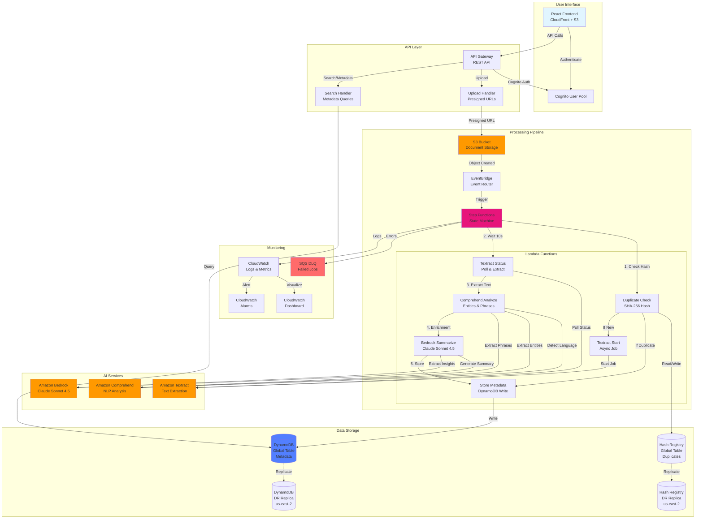
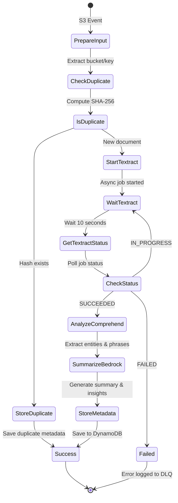

# Intelligent Document Processing Pipeline

[](https://opensource.org/licenses/MIT)
[](https://aws.amazon.com/)
[](https://aws.amazon.com/cdk/)

> **⚠️ IMPORTANT: This README describes an old architecture. For the ACTUAL deployed infrastructure, see:**
> - **[ARCHITECTURE.md](ARCHITECTURE.md)** - Complete accurate architecture documentation
> - **[AWS_DIAGRAM_CREATION_GUIDE.md](AWS_DIAGRAM_CREATION_GUIDE.md)** - Step-by-step guide to create AWS diagrams
> - **[DIAGRAM_QUICK_REFERENCE.md](DIAGRAM_QUICK_REFERENCE.md)** - Printable checklist
> - **[images/COMPONENT_SPECIFICATIONS.md](images/COMPONENT_SPECIFICATIONS.md)** - Component specifications table

A production-ready serverless document processing pipeline that automatically extracts intelligence from documents using AWS AI services. Upload documents, get instant insights powered by Amazon Textract, Comprehend, and Bedrock (Claude Sonnet 4.5).

## 🎯 Features

### Core Capabilities
- ✅ **Automatic Processing** - Documents processed within seconds of upload
- ✅ **Parallel Processing** - Handle thousands of documents concurrently
- ✅ **Duplicate Detection** - SHA-256 hashing prevents redundant processing
- ✅ **Multi-Language Support** - Automatic language detection
- ✅ **Entity Extraction** - People, places, organizations, dates
- ✅ **AI Summarization** - Claude Sonnet 4.5 generates summaries and insights
- ✅ **Visualization Dashboard** - Interactive charts and analytics
- ✅ **Document Viewer** - Full metadata and text preview
- ✅ **Disaster Recovery** - DynamoDB Global Tables with multi-region replication

### Security & Compliance
- 🔒 **End-to-End Encryption** - KMS encryption at rest, TLS in transit
- 🔒 **Authentication** - AWS Cognito with hosted UI
- 🔒 **Authorization** - IAM and Cognito authorizers on all APIs
- 🔒 **Private by Default** - No public access to resources
- 🔒 **Audit Trail** - CloudWatch logs and CloudTrail integration

### Cost Optimization
- 💰 **Serverless** - Pay only for what you use
- 💰 **S3 Lifecycle Policies** - Automatic archival (Intelligent-Tiering → Glacier → Deep Archive)
- 💰 **DynamoDB On-Demand** - No capacity planning needed
- 💰 **Duplicate Detection** - Skip expensive processing for duplicates

**Estimated Cost:** ~$20-50/month for moderate usage (1,000 documents/month, 100GB storage)

## 🏗️ Architecture

### High-Level Overview



### Step Functions Workflow



## 🌍 Disaster Recovery

### Multi-Region Architecture

This solution implements **DynamoDB Global Tables** for automatic cross-region data replication:

**Primary Region:** us-west-2 (Oregon)
- All processing pipeline resources (Lambda, Step Functions, API Gateway)
- DynamoDB primary tables with read/write operations
- S3 document storage
- CloudFront distribution (global)

**DR Region:** us-east-2 (Ohio)
- DynamoDB Global Table replicas (automatic replication)
- Read/write capability (multi-master)
- Deletion protection enabled

### Data Replication

```
┌─────────────────────────────────────────────────────────────────┐
│                    Primary Region (us-west-2)                   │
├─────────────────────────────────────────────────────────────────┤
│  DynamoDB Global Tables (Active)                                │
│  ├── document-metadata-uswest2-df3261d7                         │
│  ├── document-hash-registry-uswest2-b2e970e1                    │
│  └── document-names-uswest2-aa45fcc8                            │
│                                                                  │
│  Sub-second replication ↓                                       │
└──────────────────────────────────────────────────────────────────┘
                            ↓
┌─────────────────────────────────────────────────────────────────┐
│                     DR Region (us-east-2)                       │
├─────────────────────────────────────────────────────────────────┤
│  DynamoDB Global Table Replicas (Passive)                       │
│  ├── document-metadata (replica)                                │
│  ├── document-hash-registry (replica)                           │
│  └── document-names (replica)                                   │
│                                                                  │
│  🛡️  Deletion Protection: ENABLED                               │
└─────────────────────────────────────────────────────────────────┘
```

### Recovery Metrics

| Metric | Value | Description |
|--------|-------|-------------|
| **RPO** | <1 second | Recovery Point Objective - Max data loss |
| **RTO** | 15-30 minutes | Recovery Time Objective - Manual failover |
| **Replication Lag** | <1 second | Typical DynamoDB Global Table sync time |
| **Data Durability** | 99.999999999% | S3 + DynamoDB multi-AZ + multi-region |

### Failover Procedure

**If us-west-2 becomes unavailable:**

1. **Verify DR region health:**
   ```bash
   aws dynamodb describe-table \
     --table-name document-metadata-uswest2-df3261d7 \
     --region us-east-2
   ```

2. **Deploy stack to DR region:**
   ```bash
   export CDK_DEFAULT_REGION=us-east-2
   export DR_REGION=us-west-2  # Reverse roles
   cd intelligent-doc-processor/backend
   npx cdk deploy SimplifiedDocProcessorStackV3 --require-approval never
   ```

3. **Update CloudFront origin** (points to new API Gateway in us-east-2)

4. **Notify users** of temporary authentication changes (Cognito is region-specific)

5. **Monitor replication status**

**See [DISASTER_RECOVERY.md](docs/DISASTER_RECOVERY.md) for detailed procedures.**

### Current Limitations

**Not Replicated:**
- ❌ S3 documents (stored only in us-west-2)
  - **Recommendation**: Enable S3 Cross-Region Replication (CRR)
- ❌ Lambda functions (deploy on-demand to DR region)
- ❌ API Gateway (deploy on-demand to DR region)
- ❌ Cognito User Pool (region-specific, requires recreation)

**See [DISASTER_RECOVERY.md](docs/DISASTER_RECOVERY.md) for enhancement recommendations.**

## 📋 Prerequisites

### Required Tools
- **AWS CLI** - v2.x configured with credentials
- **Node.js** - v22.9.0 or higher
- **npm** - v10.x or higher
- **AWS CDK CLI** - v2.x (`npm install -g aws-cdk`)
- **Docker Desktop** - Required for Lambda bundling

### AWS Account Requirements
1. **Bedrock Model Access** - Enable in AWS Console:
   - Navigate to Amazon Bedrock Console
   - Click **Model access** (bottom-left)
   - Click **Manage model access**
   - Enable: **Anthropic Claude Sonnet 4.5** (`anthropic.claude-sonnet-4-5-20250929-v1:0`)

2. **Service Quotas** (Defaults usually sufficient):
   - Lambda concurrent executions: 1000
   - DynamoDB on-demand throughput: Enabled
   - S3 bucket limit: Check current usage

3. **Permissions** - Your AWS user/role needs:
   - CloudFormation full access
   - IAM role creation
   - S3, DynamoDB, Lambda, API Gateway, Cognito, CloudFront full access
   - Bedrock InvokeModel permissions

## 🚀 Quick Start

### 1. Clone Repository
```bash
git clone https://github.com/annabook21/IntelligentDoc_Processor.git
cd IntelligentDoc_Processor/backend
npm install
```

### 2. Bootstrap AWS CDK (First-time only)
```bash
ACCOUNT=$(aws sts get-caller-identity --query Account --output text)
REGION=us-west-2  # Change to your preferred region
cdk bootstrap aws://$ACCOUNT/$REGION
```

### 3. Deploy Stack
```bash
# Ensure Docker Desktop is running
cdk deploy SimplifiedDocProcessorStack --require-approval never
```

**Deployment time:** ~8-10 minutes

### 4. Save Outputs
After deployment, note these critical outputs:
```
DocumentsBucketName = intelligent-docs-<account>-<region>
CloudFrontURL = https://d1234567890abc.cloudfront.net
APIEndpoint = https://abc123.execute-api.us-west-2.amazonaws.com/prod/
UserPoolId = us-west-2_AbCdEfGhI
```

### 5. Create User Account
```bash
# Get User Pool ID from deployment outputs
USER_POOL_ID="us-west-2_AbCdEfGhI"

# Create user
aws cognito-idp admin-create-user \
  --user-pool-id $USER_POOL_ID \
  --username your-email@example.com \
  --user-attributes Name=email,Value=your-email@example.com Name=email_verified,Value=true \
  --temporary-password TempPassword123! \
  --message-action SUPPRESS

# Set permanent password
aws cognito-idp admin-set-user-password \
  --user-pool-id $USER_POOL_ID \
  --username your-email@example.com \
  --password YourSecurePassword123! \
  --permanent
```

### 6. Access Application
1. Open the CloudFront URL in your browser
2. Sign in with your credentials
3. Upload documents via the Upload page
4. View processed documents in the Dashboard

## 📊 Usage

### Upload Documents

#### Via Web Interface
1. Navigate to **Upload** page
2. Drag & drop files or click to select
3. Click **Upload Document**
4. Processing starts automatically

#### Via AWS CLI
```bash
BUCKET_NAME="intelligent-docs-<account>-<region>"
aws s3 cp document.pdf s3://$BUCKET_NAME/uploads/
```

#### Supported Formats
- PDF (including scanned/multi-page)
- DOCX
- PNG, JPG, JPEG
- TIFF

### Search Documents

#### Via Web Interface
- **Dashboard** - View all processed documents with statistics
- **Search** - Filter by language, date, or content
- **View Details** - Click any document to see full metadata

#### Via API
```bash
API_ENDPOINT="https://abc123.execute-api.us-west-2.amazonaws.com/prod"
TOKEN="<cognito-id-token>"

# Search all documents
curl -H "Authorization: Bearer $TOKEN" \
  "$API_ENDPOINT/search"

# Search by language
curl -H "Authorization: Bearer $TOKEN" \
  "$API_ENDPOINT/search?language=en&limit=10"

# Get document metadata
DOCUMENT_ID="intelligent-docs-123456-uswest2/uploads/document.pdf"
curl -H "Authorization: Bearer $TOKEN" \
  "$API_ENDPOINT/metadata?documentId=$DOCUMENT_ID"
```

### Monitor Processing

#### CloudWatch Dashboard
1. Go to CloudWatch Console
2. Navigate to **Dashboards**
3. Open: `doc-processor-metrics-<region>`

**Metrics Available:**
- Document processing rate
- Step Functions execution status
- Lambda invocation counts and errors
- API Gateway request/error rates
- DynamoDB read/write capacity

#### Check for Failures
```bash
# Get DLQ URL from outputs
DLQ_URL="https://sqs.us-west-2.amazonaws.com/123456789/lambda-dlq-us-west-2"

# Check for failed messages
aws sqs receive-message --queue-url $DLQ_URL --max-number-of-messages 10
```

#### View Logs
```bash
# Step Functions logs
aws logs tail /aws/vendedlogs/states/doc-processing-us-west-2 --follow

# Lambda logs
aws logs tail /aws/lambda/doc-duplicate-check-us-west-2 --follow
aws logs tail /aws/lambda/doc-textract-start-us-west-2 --follow
aws logs tail /aws/lambda/doc-comprehend-us-west-2 --follow
aws logs tail /aws/lambda/doc-bedrock-us-west-2 --follow
```

## 🔍 How It Works

### Document Processing Flow

1. **Upload** - Document uploaded to S3 bucket
2. **Event Trigger** - S3 sends event to EventBridge
3. **Duplicate Check** - Lambda computes SHA-256 hash
   - If duplicate: Skip processing, store minimal metadata
   - If new: Continue to step 4
4. **Text Extraction** - Amazon Textract extracts text (async for multi-page PDFs)
5. **Language Detection** - Amazon Comprehend detects language
6. **Entity Extraction** - Amazon Comprehend extracts:
   - People (PERSON)
   - Places (LOCATION)
   - Organizations (ORGANIZATION)
   - Dates (DATE)
   - Other entities (COMMERCIAL_ITEM, EVENT, QUANTITY, etc.)
7. **Key Phrases** - Amazon Comprehend extracts important phrases
8. **AI Enrichment** - Amazon Bedrock (Claude Sonnet 4.5):
   - Generates 2-3 sentence summary
   - Extracts key insights
   - Structures data (dates, amounts, names, locations, organizations)
9. **Storage** - Metadata saved to DynamoDB with GSI for language queries
10. **Replication** - Data automatically replicates to DR region (us-east-2)

### Duplicate Detection

Documents are identified by content hash (SHA-256):
- **First upload**: Hash stored in registry, full processing
- **Subsequent uploads**: Detected as duplicate, processing skipped
- **Metadata**: Duplicate documents show reference to original
- **Cost savings**: Avoid redundant Textract/Comprehend/Bedrock calls

**Example:**
```
Document 1: report.pdf → Hash: abc123... → Process fully
Document 2: report_v2.pdf (same content) → Hash: abc123... → Duplicate detected!
```

### Data Storage

#### DynamoDB Tables

**Metadata Table** (`document-metadata-<region>`)
```
Primary Key: documentId (String) - S3 bucket/key path
Sort Key: processingDate (String) - ISO timestamp
Attributes:
  - language: String
  - entities: String (JSON array)
  - keyPhrases: String (JSON array)
  - summary: String
  - insights: String
  - structuredData: String (JSON object)
  - text: String (first 10k characters)
  - fullTextLength: Number
  - status: String (PROCESSED | DUPLICATE)
  - duplicateOf: String (optional - original documentId)
  - contentHash: String (SHA-256)
GSI: LanguageIndex (language + processingDate)
```

**Hash Registry** (`document-hash-registry-<region>`)
```
Primary Key: contentHash (String) - SHA-256 hash
Attributes:
  - firstDocumentId: String
  - firstSeen: String (ISO timestamp)
  - latestDocumentId: String
  - lastSeen: String (ISO timestamp)
  - occurrences: Number
```

Both tables are **Global Tables** with replicas in us-east-2 for disaster recovery.

## 🛠️ Advanced Configuration

### Environment Variables

You can customize the deployment by setting environment variables before `cdk deploy`:

```bash
# Set DR region (default: us-east-2)
export DR_REGION=eu-west-1

# Deploy
cdk deploy SimplifiedDocProcessorStack
```

### Bedrock Model Selection

To use a different Claude model, update `backend/lib/simplified-doc-processor-stack.ts`:

```typescript
const bedrockLambda = new NodejsFunction(this, "BedrockSummarize", {
  // ...
  environment: {
    BEDROCK_MODEL_ID: "anthropic.claude-3-5-sonnet-20241022-v2:0", // Change here
  },
});
```

### S3 Lifecycle Customization

Modify `backend/lib/simplified-doc-processor-stack.ts`:

```typescript
docsBucket.addLifecycleRule({
  transitions: [
    { storageClass: s3.StorageClass.INTELLIGENT_TIERING, transitionAfter: Duration.days(30) },
    { storageClass: s3.StorageClass.GLACIER, transitionAfter: Duration.days(90) },
    { storageClass: s3.StorageClass.DEEP_ARCHIVE, transitionAfter: Duration.days(365) },
  ],
});
```

### DynamoDB Capacity Mode

The stack uses **On-Demand** mode by default. To switch to **Provisioned**:

```typescript
const globalTable = new CfnGlobalTable(this, "MetadataGlobalTable", {
  billingMode: "PROVISIONED", // Change from PAY_PER_REQUEST
  writeCapacityUnits: 5,
  readCapacityUnits: 5,
  // ...
});
```

## 🧹 Maintenance

### Cleanup Old Resources

If you deployed previous versions, cleanup scripts are provided:

```bash
cd backend/scripts

# Dry run - see what would be deleted
./cleanup-old-buckets.sh
./cleanup-old-tables.sh

# Actually delete
./cleanup-old-buckets.sh --execute
./cleanup-old-tables.sh --execute

# Force delete versioned buckets
./force-delete-buckets.sh bucket-name-1 bucket-name-2
```

### Update Stack

```bash
cd backend
git pull
npm install
cdk deploy SimplifiedDocProcessorStack
```

### Rollback Deployment

```bash
# List CloudFormation stacks
aws cloudformation list-stacks --query "StackSummaries[?StackName=='SimplifiedDocProcessorStack'].StackName"

# Rollback to previous version
aws cloudformation cancel-update-stack --stack-name SimplifiedDocProcessorStack
```

## 🔒 Security Best Practices

### Implemented by Default
- ✅ KMS encryption for S3, DynamoDB, SQS, Lambda environment variables
- ✅ TLS 1.2+ for all API communications
- ✅ Cognito authentication with password policies
- ✅ IAM least privilege policies
- ✅ S3 bucket policies blocking public access
- ✅ CloudTrail logging enabled
- ✅ VPC endpoints for S3/DynamoDB (if VPC deployed)

### Additional Recommendations
1. **Enable MFA** for Cognito users
2. **Rotate KMS keys** annually
3. **Review CloudTrail logs** regularly
4. **Set up AWS Config** for compliance monitoring
5. **Enable GuardDuty** for threat detection
6. **Use AWS WAF** on API Gateway/CloudFront (if required)

## 💰 Cost Breakdown

**Monthly costs for 1,000 documents (average 5 pages each):**

| Service | Usage | Cost |
|---------|-------|------|
| S3 Storage | 100GB | $2.30 |
| S3 Requests | 1,000 PUT, 10,000 GET | $0.01 |
| Lambda | 1,000 invocations × 6 functions | $0.20 |
| Textract | 5,000 pages | $7.50 |
| Comprehend | 5,000 units (language + entities) | $0.50 |
| Bedrock | 1,000 requests × 10k tokens avg | $30.00 |
| DynamoDB | 5,000 writes, 10,000 reads | $1.50 |
| API Gateway | 10,000 requests | $0.35 |
| CloudFront | 50GB transfer | $4.25 |
| CloudWatch | 10GB logs, 10 alarms | $5.00 |
| **Total** | | **~$51.61** |

**Cost savings with duplicate detection:**
- 10% duplicate rate: Save $3.80/month
- 25% duplicate rate: Save $9.50/month

**Free Tier eligible** for the first 12 months (significant savings on Lambda, DynamoDB, S3).

## 📚 API Reference

### Authentication

All API endpoints require authentication via Cognito ID token:

```bash
# Get token (after signing in via UI)
TOKEN=$(aws cognito-idp initiate-auth \
  --auth-flow USER_PASSWORD_AUTH \
  --client-id $USER_POOL_CLIENT_ID \
  --auth-parameters USERNAME=$USERNAME,PASSWORD=$PASSWORD \
  --query 'AuthenticationResult.IdToken' \
  --output text)
```

### Endpoints

#### Upload Document
```http
POST /upload
Authorization: Bearer <cognito-id-token>
Content-Type: application/json

{
  "fileName": "document.pdf",
  "fileType": "application/pdf"
}

Response:
{
  "uploadUrl": "https://...",
  "key": "uploads/document.pdf"
}
```

#### Search Documents
```http
GET /search?language=en&limit=10&offset=0
Authorization: Bearer <cognito-id-token>

Response:
{
  "documents": [...],
  "count": 10,
  "limit": 10,
  "offset": 0
}
```

#### Get Document Metadata
```http
GET /metadata?documentId=bucket/key/document.pdf
Authorization: Bearer <cognito-id-token>

Response:
{
  "documentId": "...",
  "processingDate": "2025-11-03T19:01:35Z",
  "language": "en",
  "entities": [...],
  "keyPhrases": [...],
  "summary": "...",
  "insights": "...",
  "structuredData": {...},
  "status": "PROCESSED",
  "contentHash": "abc123..."
}
```

## 🐛 Troubleshooting

### Documents Not Processing

**Symptoms:** Documents uploaded but no metadata appears in dashboard

**Checks:**
1. Verify EventBridge rule is enabled:
   ```bash
   aws events list-rules --name-prefix DocumentProcessingRule
   ```

2. Check Step Functions execution:
   ```bash
   aws stepfunctions list-executions \
     --state-machine-arn arn:aws:states:us-west-2:ACCOUNT:stateMachine:doc-processing-us-west-2 \
     --max-results 10
   ```

3. Check DLQ for errors:
   ```bash
   aws sqs receive-message --queue-url $DLQ_URL
   ```

4. Review CloudWatch Logs:
   ```bash
   aws logs tail /aws/vendedlogs/states/doc-processing-us-west-2 --follow
   ```

### CORS Errors in Frontend

**Symptoms:** API calls fail with CORS errors

**Solution:**
1. Ensure you're accessing via CloudFront URL (not direct S3 URL)
2. Check API Gateway CORS settings:
   ```bash
   aws apigateway get-integration \
     --rest-api-id $API_ID \
     --resource-id $RESOURCE_ID \
     --http-method OPTIONS
   ```

### Authentication Issues

**Symptoms:** "Amplify has not been configured" or sign-in failures

**Solution:**
1. Clear browser cache and cookies
2. Check `config.json` is deployed to S3:
   ```bash
   aws s3 cp s3://$FRONTEND_BUCKET/config.json -
   ```
3. Verify Cognito User Pool and Client exist

### Textract Failures

**Symptoms:** "InvalidS3ObjectException" or "UnsupportedDocumentException"

**Common causes:**
- Encrypted PDFs: Textract cannot process password-protected files
- Unsupported format: Textract supports PDF, PNG, JPG, TIFF only
- File size: Maximum 500MB per file
- Permissions: Verify Textract has S3 GetObject permission

**Solution:**
Check Step Functions execution history for detailed error messages.


## 📄 License

This project is licensed under the MIT License - see the [LICENSE](LICENSE) file for details.
