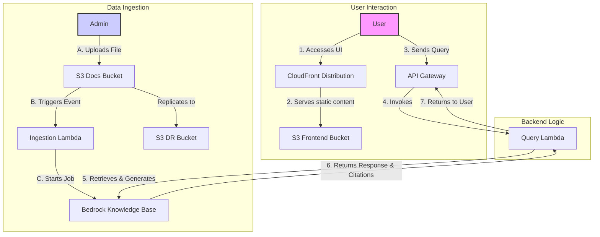

# AWS Contextual Chatbot Demo with Amazon Bedrock

This repository contains a demonstration of a contextual chatbot using Amazon Bedrock Knowledge Bases. It provides a serverless architecture that is easily deployable with the AWS CDK.

---

⚠️ **CRITICAL PRE-DEPLOYMENT STEP: ENABLE BEDROCK MODEL ACCESS**
--------------------------------------------------------------------

Before you deploy this application, you **MUST** enable access to the required foundation models in your AWS account. **Failure to do so will cause the deployment to fail with an error.**

1.  Navigate to the **[Amazon Bedrock console](https://console.aws.amazon.com/bedrock/home)** in your AWS account.
2.  In the bottom-left corner, click on **Model access**.
3.  Click **Manage model access** in the top-right.
4.  Enable access for the following two models:
    *   ✅ **Titan Embeddings G1 - Text:** `amazon.titan-embed-text-v1` (Used for the Knowledge Base)
    *   ✅ **Anthropic Claude 3 Sonnet:** `anthropic.claude-3-sonnet-20240229-v1:0` (Used for generating answers)

Click "Save changes" and wait for access to be granted before proceeding with deployment.

---

## Architecture

The architecture is fully serverless and event-driven:



---

## Core Components

*(kept unchanged — frontend, API Gateway, backend, ingestion pipeline as in your draft)*

---

## Deployment

### Prerequisites

Make sure you have these installed/configured first:

* **AWS CLI** installed and configured (`aws configure`) with valid access key/secret key.

  * Verify with: `aws sts get-caller-identity`
* **Node.js** ≥ 22.9.0 and npm.
* **AWS CDK CLI**:

  ```bash
  npm install -g aws-cdk
  ```
* **Docker Desktop** installed and running (required for bundling Lambda assets).
* **Set your region** to `us-west-2` (or your preferred one):

  ```bash
  export AWS_DEFAULT_REGION=us-west-2
  ```

### Steps

1. **Clone the repository**

   ```bash
   git clone <repository-url>
   cd <repository-name>/backend
   ```
2. **Install dependencies**

   ```bash
   npm install
   npm install aws-cdk-lib constructs typescript ts-node --save-dev
   ```
3. **Bootstrap your AWS account**
   *(only needed once per account/region)*

   ```bash
   cdk bootstrap aws://<your-account-id>/us-west-2
   ```

   🔹 If you see `StagingBucket already exists` errors, delete the old bucket `cdk-hnb659fds-assets-<account>-us-west-2` in S3 and re-run bootstrap.
4. **Synthesize the stack**

   ```bash
   cdk synth
   ```

   This outputs the CloudFormation template so you can preview what will be deployed.
### 5. CRITICAL STEP 5: Enable Bedrock Model Access

For the chatbot to work, you MUST enable access to the specific foundation models in the Amazon Bedrock console.

1.  Navigate to the [Amazon Bedrock console](https://console.aws.amazon.com/bedrock/home) in your AWS account.
2.  In the bottom-left corner, click on **Model access**.
3.  Click **Manage model access** in the top-right.
4.  Enable access for the following models:
    *   **Titan Embeddings G1 - Text:** `amazon.titan-embed-text-v1` (for the Knowledge Base)
    *   **Anthropic Claude 3 Sonnet:** `anthropic.claude-3-sonnet-20240229-v1:0` (for generating answers)

**FAILURE TO ENABLE THESE MODELS WILL CAUSE 500 ERRORS.**

## Usage

1.  After a successful `cdk deploy`, the CloudFormation outputs will display the `CloudFrontURL`.
2.  Navigate to this URL in your browser.
3.  The API URL is **auto-configured**. The UI will show "API URL (Auto-configured)".
4.  Use the "Upload Documents" section to upload one or more files (PDF, TXT, DOCX, MD) to the knowledge base.
5.  Wait for the ingestion status to show "✅ Ingestion complete!". It may take an additional minute for the context to become available.
6.  Ask a question related to the documents you uploaded.

The chatbot will now answer based on the context provided in your documents.

## Troubleshooting

### Deployment Issues

* **Error: `Cannot connect to the Docker daemon`**
  → Make sure Docker Desktop is installed and running. Test with `docker ps`.

* **Error: `SSM parameter /cdk-bootstrap/... not found`**
  → Run `cdk bootstrap aws://<account>/us-west-2`.

* **Error: `StagingBucket already exists` during bootstrap**
  → Delete the old S3 bucket `cdk-hnb659fds-assets-<account>-us-west-2` or rerun bootstrap with `--bootstrap-bucket-name`.

* **Deploying to wrong region (`us-east-1` instead of `us-west-2`)**
  → Set region in `bin/backend.ts`:

  ```ts
  new BackendStack(app, 'BackendStack', {
    env: { account: process.env.CDK_DEFAULT_ACCOUNT, region: 'us-west-2' }
  });
  ```

  Or set `export AWS_DEFAULT_REGION=us-west-2` before deploying.

### Runtime Issues

* **Error: "You don't have access to the model"** or **"ValidationException: Invalid input or configuration"**
  → Enable Bedrock model access (see step 5 above). The **Titan Embeddings** model is **required** for document ingestion!

* **Chatbot returns "Server side error"**
  → Check CloudWatch logs: `aws logs tail /aws/lambda/query-bedrock-llm --follow --region us-west-2`
  → Ensure you have uploaded documents and they have been processed (wait 1-2 minutes after upload)

* **File upload doesn't work**
  → Check browser console for errors
  → Verify the upload Lambda exists: `aws lambda get-function --function-name generate-upload-url --region us-west-2`

* **Documents not appearing in knowledge base**
  → Check ingestion logs: `aws logs tail /aws/lambda/start-ingestion-trigger --follow --region us-west-2`
  → Verify Titan Embeddings model access is enabled


