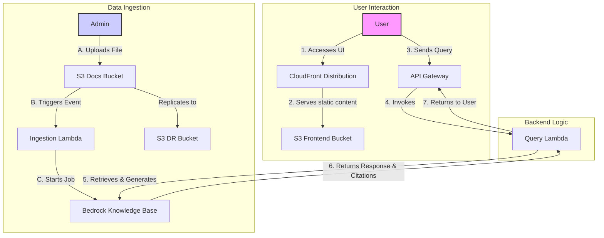

# Contextual Chatbot with Amazon Bedrock Knowledge Bases

This project provides a fully deployable, self-contained contextual chatbot application using Amazon Bedrock Knowledge Bases. It features a complete backend infrastructure defined in AWS CDK and a simple React frontend.

## Architecture

The entire application is defined as Infrastructure as Code (IaC), allowing for easy and repeatable deployments. The architecture consists of a serverless backend, a document ingestion pipeline, and a web-based frontend.



## Core Components

### 1. Frontend

-   **CloudFront Distribution (`AWS::CloudFront::Distribution`):** Acts as the primary entry point for users. It serves the frontend application's static files from the S3 bucket and provides caching and HTTPS.
-   **Frontend S3 Bucket (`AWS::S3::Bucket`):** A private S3 bucket that stores the built React application (HTML, CSS, JS). Access is restricted to CloudFront via an Origin Access Identity (OAI).

### 2. API Gateway

-   **API Gateway (`AWS::ApiGateway::RestApi`):** Provides a RESTful API endpoint for the frontend to communicate with the backend. It's protected by a Web Application Firewall (WAF).
    -   **`/docs` (POST):** The primary endpoint for submitting user queries to the chatbot.
    -   **`/urls` (GET) & `/web-urls` (POST):** Endpoints for managing the seed URLs for the web crawler data source.

### 3. Backend Logic

-   **Query Lambda (`AWS::Lambda::Function`):** The core of the chatbot's logic. It's invoked by the API Gateway and is responsible for:
    -   Receiving the user's query.
    -   Calling the Bedrock `RetrieveAndGenerate` API to get an answer from the knowledge base.
    -   Returning the response, including citations, to the user.

### 4. Data Ingestion & Knowledge Base

-   **Docs S3 Bucket (`AWS::S3::Bucket`):** The primary data source for the knowledge base. When a user uploads a file to this bucket, it triggers the ingestion process. It is configured with versioning and cross-region replication for disaster recovery.
-   **DR S3 Bucket (`AWS::S3::Bucket`):** A replica of the Docs S3 Bucket in a different region to ensure data durability.
-   **Ingestion Lambda (`AWS::Lambda::Function`):** Triggered by S3 `PUT` events on the Docs S3 Bucket. This function starts an ingestion job in Bedrock, which processes the new document and adds it to the knowledge base.
-   **Web Crawler Lambdas (`AWS::Lambda::Function`):** A set of Lambdas to create, manage, and periodically trigger a web crawling data source for the Bedrock Knowledge Base.
-   **Bedrock Knowledge Base (`Bedrock::VectorKnowledgeBase`):** The heart of the RAG pipeline. It automatically chunks and vectorizes documents from the S3 data source and stores them in a vector store for efficient retrieval.

## Deployment

The entire application can be deployed via the AWS CDK.

### Prerequisites

-   AWS CLI installed and configured with your credentials.
-   Node.js and npm installed.
-   AWS CDK installed (`npm install -g aws-cdk`).
-   Docker running on your local machine (for bundling Lambda assets).

### Steps

1.  **Clone the repository:**
    ```bash
    git clone <repository-url>
    cd <repository-name>/backend
    ```
2.  **Install dependencies:**
    ```bash
    npm install
    ```
3.  **(Optional) Bootstrap your AWS account for CDK:**
    *If you've never used CDK in this account/region before.*
    ```bash
    cdk bootstrap
    ```
4.  **Synthesize the CloudFormation Template:**
    *To review the resources that will be created.*
    ```bash
    cdk synth
    ```
5.  **Deploy the stack:**
    ```bash
    cdk deploy
    ```

After deployment, the CDK will output the URLs for the API Gateway and the CloudFront distribution.

## Usage

1.  Navigate to the **CloudFrontURL** output from the deployment.
2.  Use the interface to upload documents to the **DocsBucketName** S3 bucket.
3.  Once the documents are uploaded, the ingestion process will start automatically.
4.  You can then use the chat interface to ask questions about the documents you've uploaded.
