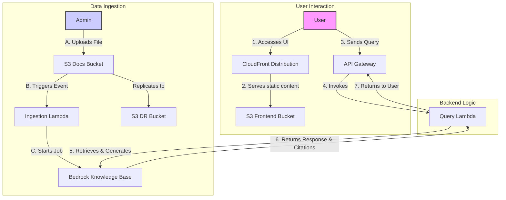

# Contextual Chatbot with Amazon Bedrock Knowledge Bases

This project provides a fully deployable, self-contained contextual chatbot application using Amazon Bedrock Knowledge Bases. It features a complete backend infrastructure defined in AWS CDK and a simple React frontend.

---

## Architecture

The entire application is defined as Infrastructure as Code (IaC), allowing for easy and repeatable deployments. The architecture consists of a serverless backend, a document ingestion pipeline, and a web-based frontend.



---

## Core Components

*(kept unchanged — frontend, API Gateway, backend, ingestion pipeline as in your draft)*

---

## Deployment

### Prerequisites

Make sure you have these installed/configured first:

* **AWS CLI** installed and configured (`aws configure`) with valid access key/secret key.

  * Verify with: `aws sts get-caller-identity`
* **Node.js** ≥ 22.9.0 and npm.
* **AWS CDK CLI**:

  ```bash
  npm install -g aws-cdk
  ```
* **Docker Desktop** installed and running (required for bundling Lambda assets).
* **Set your region** to `us-west-2` (or your preferred one):

  ```bash
  export AWS_DEFAULT_REGION=us-west-2
  ```

### Steps

1. **Clone the repository**

   ```bash
   git clone <repository-url>
   cd <repository-name>/backend
   ```
2. **Install dependencies**

   ```bash
   npm install
   npm install aws-cdk-lib constructs typescript ts-node --save-dev
   ```
3. **Bootstrap your AWS account**
   *(only needed once per account/region)*

   ```bash
   cdk bootstrap aws://<your-account-id>/us-west-2
   ```

   🔹 If you see `StagingBucket already exists` errors, delete the old bucket `cdk-hnb659fds-assets-<account>-us-west-2` in S3 and re-run bootstrap.
4. **Synthesize the stack**

   ```bash
   cdk synth
   ```

   This outputs the CloudFormation template so you can preview what will be deployed.
5. **Enable Bedrock Model Access** ⚠️ **CRITICAL STEP**

   Before deployment, you **must** enable access to Bedrock models in your AWS account:

   a. Go to [AWS Bedrock Console → Model access](https://us-west-2.console.aws.amazon.com/bedrock/home?region=us-west-2#/modelaccess)
   
   b. Click **Edit** or **Manage model access**
   
   c. Enable these models:
   
      - ✅ **Amazon Titan Embeddings G1 - Text** (`amazon.titan-embed-text-v1`) - **REQUIRED for document ingestion**
      - ✅ **Amazon Titan Text Premier** - Optional, for queries
      - ✅ **Anthropic Claude 3 Sonnet** - Optional, for queries
      - ✅ **Anthropic Claude Instant** - Default model for queries
   
   d. Click **Save changes** or **Request model access**
   
   e. Wait 1-2 minutes for access to be granted

   **Note:** Without Titan Embeddings enabled, document ingestion will fail!

6. **Deploy**

   ```bash
   cdk deploy
   ```

   This creates all the resources (API Gateway, S3 buckets, Lambdas, CloudFront, etc.).

---

## Usage

1. **Access the UI**
   - Copy the **CloudFrontURL** from the deployment output
   - Open it in your browser
   - The API URL is **automatically configured** - no manual setup needed!

2. **Upload Documents**
   - Use the **file upload feature** in the UI (Step 3)
   - Supported formats: PDF, TXT, DOCX, MD
   - Files are automatically processed and added to the knowledge base
   - Wait 1-2 minutes for ingestion to complete

3. **Ask Questions**
   - Select a model (or use the default)
   - Type your question
   - The chatbot returns answers with citations from your uploaded documents

---

## Troubleshooting

### Deployment Issues

* **Error: `Cannot connect to the Docker daemon`**
  → Make sure Docker Desktop is installed and running. Test with `docker ps`.

* **Error: `SSM parameter /cdk-bootstrap/... not found`**
  → Run `cdk bootstrap aws://<account>/us-west-2`.

* **Error: `StagingBucket already exists` during bootstrap**
  → Delete the old S3 bucket `cdk-hnb659fds-assets-<account>-us-west-2` or rerun bootstrap with `--bootstrap-bucket-name`.

* **Deploying to wrong region (`us-east-1` instead of `us-west-2`)**
  → Set region in `bin/backend.ts`:

  ```ts
  new BackendStack(app, 'BackendStack', {
    env: { account: process.env.CDK_DEFAULT_ACCOUNT, region: 'us-west-2' }
  });
  ```

  Or set `export AWS_DEFAULT_REGION=us-west-2` before deploying.

### Runtime Issues

* **Error: "You don't have access to the model"** or **"ValidationException: Invalid input or configuration"**
  → Enable Bedrock model access (see step 5 above). The **Titan Embeddings** model is **required** for document ingestion!

* **Chatbot returns "Server side error"**
  → Check CloudWatch logs: `aws logs tail /aws/lambda/query-bedrock-llm --follow --region us-west-2`
  → Ensure you have uploaded documents and they have been processed (wait 1-2 minutes after upload)

* **File upload doesn't work**
  → Check browser console for errors
  → Verify the upload Lambda exists: `aws lambda get-function --function-name generate-upload-url --region us-west-2`

* **Documents not appearing in knowledge base**
  → Check ingestion logs: `aws logs tail /aws/lambda/start-ingestion-trigger --follow --region us-west-2`
  → Verify Titan Embeddings model access is enabled


