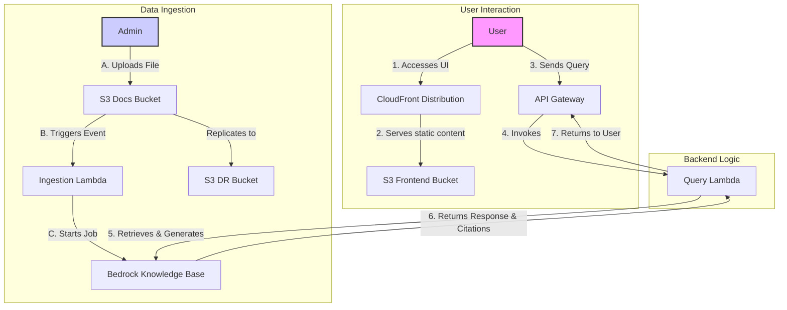

# AWS Contextual Chatbot Demo with Amazon Bedrock

This repository contains a demonstration of a contextual chatbot using Amazon Bedrock Knowledge Bases. It provides a serverless architecture that is easily deployable with the AWS CDK.

---

⚠️ **CRITICAL PRE-DEPLOYMENT STEP: ENABLE BEDROCK MODEL ACCESS**
--------------------------------------------------------------------

Before you deploy this application, you **MUST** enable access to the required foundation models in your AWS account. **Failure to do so will cause the deployment to fail with an error.**

1.  Navigate to the **[Amazon Bedrock console](https://console.aws.amazon.com/bedrock/home)** in your AWS account.
2.  In the bottom-left corner, click on **Model access**.
3.  Click **Manage model access** in the top-right.
4.  Enable access for the following two models:
    *   ✅ **Titan Embeddings G1 - Text:** `amazon.titan-embed-text-v1` (Used for the Knowledge Base)
    *   ✅ **Anthropic Claude 3 Sonnet:** `anthropic.claude-3-sonnet-20240229-v1:0` (Used for generating answers)

Click "Save changes" and wait for access to be granted before proceeding with deployment.

---

## Architecture

The architecture is fully serverless and event-driven:



---

## Core Components

### 1. Frontend

- **CloudFront Distribution (`AWS::CloudFront::Distribution`):** Acts as the primary entry point for users. It serves the frontend application's static files from the S3 bucket and provides caching and HTTPS.
- **Frontend S3 Bucket (`AWS::S3::Bucket`):** A private S3 bucket that stores the built React application (HTML, CSS, JS). Access is restricted to CloudFront via Origin Access Control (OAC).

### 2. API Gateway

- **API Gateway (`AWS::ApiGateway::RestApi`):** Provides a RESTful API endpoint for the frontend to communicate with the backend. It includes throttling and usage plans for basic protection.
  - **`/docs` (POST):** The primary endpoint for submitting user queries to the chatbot.
  - **`/upload` (POST):** Generates pre-signed URLs for direct file uploads to S3.
  - **`/ingestion-status` (GET):** Returns the status of document ingestion jobs.

### 3. Backend Logic

- **Query Lambda (`AWS::Lambda::Function`):** The core of the chatbot's logic. It's invoked by the API Gateway and is responsible for:
  - Receiving the user's query.
  - Calling the Bedrock `Retrieve` API to get relevant context from the knowledge base.
  - Calling the Bedrock `InvokeModel` API with Claude 3 Sonnet to generate an answer.
  - Applying Bedrock Guardrails for content safety.
  - Returning the response, including citations, to the user.

### 4. Data Ingestion & Knowledge Base

- **Docs S3 Bucket (`AWS::S3::Bucket`):** The primary data source for the knowledge base. When a user uploads a file to this bucket, it triggers the ingestion process. It is configured with versioning for data protection.
- **Ingestion Lambda (`AWS::Lambda::Function`):** Triggered by S3 `PUT` events on the Docs S3 Bucket. This function starts an ingestion job in Bedrock, which processes the new document and adds it to the knowledge base.
- **Upload Lambda (`AWS::Lambda::Function`):** Generates pre-signed S3 URLs to allow the frontend to upload files directly to the Docs S3 Bucket without proxying through the backend.
- **Ingestion Status Lambda (`AWS::Lambda::Function`):** Polls Bedrock to check the status of ingestion jobs and reports back to the frontend.
- **Bedrock Knowledge Base (`Bedrock::VectorKnowledgeBase`):** The heart of the RAG pipeline. It automatically chunks documents into 500-token segments with 20% overlap, vectorizes them using Titan Embeddings, and stores them in a vector store for efficient retrieval.

### 5. Security & Content Safety

- **Bedrock Guardrails (`AWS::Bedrock::CfnGuardrail`):** Content filtering for harmful or inappropriate inputs and outputs. Configured with HIGH sensitivity for sexual content, violence, and hate speech, and MEDIUM for insults.
- **Model Access Check (`AWS::Lambda::Function`):** A pre-flight Lambda that validates Bedrock model access before deployment to prevent deployment failures.
- **API Usage Plan:** Throttling limits (100 req/sec rate, 200 burst) for basic API protection.

### 6. Monitoring & Observability

- **CloudWatch Alarms:** Three alarms for monitoring system health:
  - Query Lambda errors (>5 errors in 5 minutes)
  - Ingestion Lambda errors (>3 errors in 5 minutes)
  - Dead Letter Queue messages (any message appears)
- **SNS Topic (`AWS::SNS::Topic`):** Publishes alerts when alarms trigger.
- **Dead Letter Queue (`AWS::SQS::Queue`):** Captures failed ingestion events for manual review and retry.
- **X-Ray Tracing:** Enabled on all Lambda functions for distributed tracing and performance analysis.

---

## Deployment

### Quick Start: Automated DR Deployment 🚀

**For production deployments with disaster recovery**, use the automated script:

```bash
# Deploy to both us-west-2 (primary) and us-east-1 (failover)
./deploy-chatbot-with-dr.sh

# Or with custom domain for Route 53 failover
./deploy-chatbot-with-dr.sh --domain api.yourdomain.com
```

This script automatically:
- ✅ Checks Bedrock model availability in both regions
- ✅ Bootstraps both regions
- ✅ Deploys full stack to primary and failover
- ✅ Creates Route 53 health checks
- ✅ Configures automatic failover

**See [DISASTER_RECOVERY_SETUP.md](DISASTER_RECOVERY_SETUP.md) for details.**

---

### Manual Deployment

### Prerequisites

Make sure you have these installed/configured first:

* **AWS CLI** installed and configured (`aws configure`) with valid access key/secret key.

  * Verify with: `aws sts get-caller-identity`
* **Node.js** ≥ 22.9.0 and npm.
* **AWS CDK CLI**:

  ```bash
  npm install -g aws-cdk
  ```
* **Docker Desktop** installed and running (required for bundling Lambda assets).
* **Set your region** (supports `us-west-2` or `us-east-1`):

  ```bash
  export AWS_DEFAULT_REGION=us-west-2  # or us-east-1
  ```

### Steps

1. **Clone the repository**

   ```bash
   git clone <repository-url>
   cd <repository-name>/backend
   ```
2. **Install dependencies**

   ```bash
   npm install
   npm install aws-cdk-lib constructs typescript ts-node --save-dev
   ```
3. **Bootstrap your AWS account**
   *(only needed once per account/region)*

   ```bash
   # For us-west-2
   cdk bootstrap aws://<your-account-id>/us-west-2
   
   # OR for us-east-1
   cdk bootstrap aws://<your-account-id>/us-east-1
   ```

   🔹 If you see `StagingBucket already exists` errors, delete the old bucket `cdk-hnb659fds-assets-<account>-<region>` in S3 and re-run bootstrap.
4. **Synthesize the stack**

   ```bash
   cdk synth
   ```

   This outputs the CloudFormation template so you can preview what will be deployed.
### 5. CRITICAL STEP 5: Enable Bedrock Model Access

For the chatbot to work, you MUST enable access to the specific foundation models in the Amazon Bedrock console.

1.  Navigate to the [Amazon Bedrock console](https://console.aws.amazon.com/bedrock/home) in your AWS account.
2.  In the bottom-left corner, click on **Model access**.
3.  Click **Manage model access** in the top-right.
4.  Enable access for the following models:
    *   **Titan Embeddings G1 - Text:** `amazon.titan-embed-text-v1` (for the Knowledge Base)
    *   **Anthropic Claude 3 Sonnet:** `anthropic.claude-3-sonnet-20240229-v1:0` (for generating answers)

**FAILURE TO ENABLE THESE MODELS WILL CAUSE 500 ERRORS.**

## Usage

1.  After a successful `cdk deploy`, the CloudFormation outputs will display the `CloudFrontURL`.
2.  Navigate to this URL in your browser.
3.  The API URL is **auto-configured**. The UI will show "API URL (Auto-configured)".
4.  Use the "Upload Documents" section to upload one or more files (PDF, TXT, DOCX, MD) to the knowledge base.
5.  Wait for the ingestion status to show "✅ Ingestion complete!". It may take an additional minute for the context to become available.
6.  Ask a question related to the documents you uploaded.

The chatbot will now answer based on the context provided in your documents.

## Troubleshooting

### Deployment Issues

* **Error: `Cannot connect to the Docker daemon`**
  → Make sure Docker Desktop is installed and running. Test with `docker ps`.

* **Error: `SSM parameter /cdk-bootstrap/... not found`**
  → Run `cdk bootstrap aws://<account>/<region>` (replace with your region).

* **Error: `StagingBucket already exists` during bootstrap**
  → Delete the old S3 bucket `cdk-hnb659fds-assets-<account>-<region>` or rerun bootstrap with `--bootstrap-bucket-name`.

* **Deploying to different region**
  → Set region before deploying:

  ```bash
  export AWS_DEFAULT_REGION=us-east-1  # or us-west-2
  cdk deploy
  ```
  
  ⚠️ **Important**: Enable Bedrock model access in the Bedrock console for your target region first.

### Runtime Issues

* **Error: "You don't have access to the model"** or **"ValidationException: Invalid input or configuration"**
  → Enable Bedrock model access (see step 5 above). The **Titan Embeddings** model is **required** for document ingestion!

* **Chatbot returns "Server side error"**
  → Check CloudWatch logs: `aws logs tail /aws/lambda/query-bedrock-llm --follow --region <your-region>`
  → Ensure you have uploaded documents and they have been processed (wait 1-2 minutes after upload)

* **File upload doesn't work**
  → Check browser console for errors
  → Verify the upload Lambda exists: `aws lambda get-function --function-name generate-upload-url --region <your-region>`

* **Documents not appearing in knowledge base**
  → Check ingestion logs: `aws logs tail /aws/lambda/start-ingestion-trigger --follow --region <your-region>`
  → Verify Titan Embeddings model access is enabled


