# AWS Contextual Chatbot Demo with Amazon Bedrock

This repository contains a demonstration of a contextual chatbot using Amazon Bedrock Knowledge Bases. It provides a serverless architecture that is easily deployable with the AWS CDK.

---

⚠️ **CRITICAL PRE-DEPLOYMENT STEP: ENABLE BEDROCK MODEL ACCESS**
--------------------------------------------------------------------

Before you deploy this application, you **MUST** enable access to the required foundation models in your AWS account. **Failure to do so will cause the deployment to fail with an error.**

1.  Navigate to the **[Amazon Bedrock console](https://console.aws.amazon.com/bedrock/home)** in your AWS account.
2.  In the bottom-left corner, click on **Model access**.
3.  Click **Manage model access** in the top-right.
4.  Enable access for the following two models:
    *   ✅ **Titan Embeddings G1 - Text:** `amazon.titan-embed-text-v1` (Used for the Knowledge Base)
    *   ✅ **Anthropic Claude 3 Sonnet:** `anthropic.claude-3-sonnet-20240229-v1:0` (Used for generating answers)

Click "Save changes" and wait for access to be granted before proceeding with deployment.

---

## Architecture

The architecture is fully serverless, event-driven, and **multi-region with automatic failover**:

```mermaid
graph TD
    subgraph "Global CDN Layer"
        User[<fa:fa-user> User] -->|1. HTTPS| CF[<fa:fa-cloud> CloudFront]
        CF -->|Primary Origin| FE_S3_1[<fa:fa-box> S3 Frontend W2]
        CF -.->|Failover on 5xx| FE_S3_2[<fa:fa-box> S3 Frontend E1]
    end

    subgraph "Primary Region - us-west-2"
        User -->|2. API Requests| APIGW1[<fa:fa-server> API Gateway]
        APIGW1 -->|/docs| QueryLambda1[<fa:fa-bolt> Query Lambda]
        APIGW1 -->|/upload| UploadLambda1[<fa:fa-bolt> Upload Lambda]
        APIGW1 -->|/ingestion-status| StatusLambda1[<fa:fa-bolt> Status Lambda]
        APIGW1 -->|/health| HealthLambda1[<fa:fa-heartbeat> Health Lambda]
        
        QueryLambda1 -->|Retrieve & Generate| BedrockKB1[<fa:fa-brain> Bedrock KB]
        DS_S3_1[<fa:fa-box> Docs S3] -->|ObjectCreated| IngestLambda1[<fa:fa-bolt> Ingest Lambda]
        IngestLambda1 -->|Start Job| BedrockKB1
        
        DS_S3_1 -.->|Cross-Region Replication| DS_S3_2
    end

    subgraph "Failover Region - us-east-1"
        User -.->|Manual switch| APIGW2[<fa:fa-server> API Gateway]
        APIGW2 -.->|/docs| QueryLambda2[<fa:fa-bolt> Query Lambda]
        APIGW2 -.->|/health| HealthLambda2[<fa:fa-heartbeat> Health Lambda]
        
        QueryLambda2 -.->|Retrieve & Generate| BedrockKB2[<fa:fa-brain> Bedrock KB]
        DS_S3_2[<fa:fa-box> Docs S3 Replica]
    end

    subgraph "Monitoring & Observability"
        CW[<fa:fa-chart-line> CloudWatch Dashboard] -->|Monitors| APIGW1
        CW -->|Monitors| QueryLambda1
        CW -->|Monitors| IngestLambda1
        Alarms[<fa:fa-bell> CloudWatch Alarms] -->|Alerts| SNS[<fa:fa-envelope> SNS Topic]
        DLQ[<fa:fa-warning> Dead Letter Queue]
    end

    style User fill:#f9f,stroke:#333,stroke-width:2px
    style CF fill:#8C4FFF,stroke:#333,stroke-width:2px
    style CW fill:#FF9900,stroke:#333,stroke-width:2px
```



---

## Core Components

### 1. Frontend

- **CloudFront Distribution (`AWS::CloudFront::Distribution`):** Global CDN entry point serving the React app from two private S3 REST origins via OAC. Uses an origin group to fail over from the primary S3 origin (us-west-2) to the failover S3 origin (us-east-1) on 5xx.
- **Frontend S3 Buckets (`AWS::S3::Bucket`):** Private buckets (in each region) that store static assets. Access is restricted to CloudFront via Origin Access Control (OAC). No website endpoints or public access are used.

### 2. API Gateway

- **API Gateway (`AWS::ApiGateway::RestApi`):** Provides a RESTful API endpoint for the frontend to communicate with the backend. It includes throttling and usage plans for basic protection.
  - **`/docs` (POST):** The primary endpoint for submitting user queries to the chatbot.
  - **`/upload` (POST):** Generates pre-signed URLs for direct file uploads to S3.
  - **`/ingestion-status` (GET):** Returns the status of document ingestion jobs.
  - **`/health` (GET):** Health check endpoint that tests Bedrock KB connectivity. Can be used for monitoring or custom failover logic.

### 3. Backend Logic (5 Lambda Functions)

- **Query Lambda (`AWS::Lambda::Function`):** The core of the chatbot's logic. It's invoked by the API Gateway and is responsible for:
  - Receiving the user's query.
  - Calling the Bedrock `Retrieve` API to get relevant context from the knowledge base.
  - Calling the Bedrock `InvokeModel` API with Claude 3 Sonnet to generate an answer.
  - Applying Bedrock Guardrails for content safety (input and output filtering).
  - Returning the response, including citations, to the user.
  
- **Upload Lambda (`AWS::Lambda::Function`):** Generates pre-signed S3 URLs to allow the frontend to upload files directly to the Docs S3 Bucket without proxying through the backend.

- **Ingestion Lambda (`AWS::Lambda::Function`):** Triggered by S3 `PUT` events on the Docs S3 Bucket. This function starts an ingestion job in Bedrock, which processes the new document and adds it to the knowledge base.

- **Ingestion Status Lambda (`AWS::Lambda::Function`):** Polls Bedrock to check the status of ingestion jobs and reports back to the frontend.

- **Health Check Lambda (`AWS::Lambda::Function`):** Tests actual Bedrock Knowledge Base connectivity and returns system health status for monitoring.

### 4. Data Ingestion & Knowledge Base

- **Docs S3 Bucket (`AWS::S3::Bucket`):** The primary data source for the knowledge base. When a user uploads a file to this bucket, it triggers the ingestion process. It is configured with versioning for data protection and optional cross-region replication for DR.
- **Bedrock Knowledge Base (`Bedrock::VectorKnowledgeBase`):** The heart of the RAG pipeline. It automatically chunks documents into 500-token segments with 20% overlap, vectorizes them using Titan Embeddings, and stores them in a vector store for efficient retrieval.

### 5. Security & Content Safety

- **Bedrock Guardrails (`AWS::Bedrock::CfnGuardrail`):** Content filtering for harmful or inappropriate inputs and outputs. Configured with HIGH sensitivity for sexual content, violence, and hate speech, and MEDIUM for insults.
- **Model Access Check (`AWS::Lambda::Function`):** A pre-flight Lambda that validates Bedrock model access before deployment to prevent deployment failures.
- **API Usage Plan:** Throttling limits (100 req/sec rate, 200 burst) for basic API protection.

### 6. Monitoring & Observability

- **CloudWatch Dashboard (`AWS::CloudWatch::Dashboard`):** Interactive dashboard named `contextual-chatbot-metrics` with 5 widget rows:
  - API Gateway performance (requests and errors)
  - Lambda function errors (Query and Ingestion)
  - Lambda duration metrics
  - Dead Letter Queue message count
  - Lambda invocation counts
- **CloudWatch Alarms:** Three alarms for monitoring system health:
  - Query Lambda errors (>5 errors in 5 minutes)
  - Ingestion Lambda errors (>3 errors in 5 minutes)
  - Dead Letter Queue messages (any message appears)
- **SNS Topic (`AWS::SNS::Topic`):** Publishes alerts when alarms trigger.
- **Dead Letter Queue (`AWS::SQS::Queue`):** Captures failed ingestion events for manual review and retry.
- **X-Ray Tracing:** Enabled on all Lambda functions for distributed tracing and performance analysis.

### 7. Disaster Recovery & High Availability

- **Frontend Failover (CloudFront Origin Group):** Frontend remains on a single CloudFront URL. If the primary S3 origin (us-west-2) returns 5xx, CloudFront automatically retries against the failover S3 origin (us-east-1) and serves content without DNS changes. **RTO: < 1 second (automatic).**
- **Backend API Failover (Manual):** Both regions deploy full backend stacks with `/health` endpoints. To fail over the backend API, manually update `config.json` in both S3 frontend buckets to point to the failover API URL, then invalidate CloudFront cache. **RTO: Manual (minutes to hours depending on response time).**
- **Document Replication:** S3 Cross-Region Replication ensures documents uploaded to primary are automatically copied to failover. **RPO: 0-15 minutes.**

---

## Deployment

### Multi-Region Deployment with CDK 🚀

**CDK automatically deploys to both us-west-2 (primary) and us-east-1 (failover)** for disaster recovery:

```bash
cd backend

# Bootstrap both regions (one-time setup)
ACCOUNT=$(aws sts get-caller-identity --query Account --output text)
cdk bootstrap aws://$ACCOUNT/us-west-2
cdk bootstrap aws://$ACCOUNT/us-east-1

# Deploy to BOTH regions with a single command
cdk deploy --all
```

This deployment:
- ✅ Creates `BackendStack-Primary` in us-west-2 with CloudFront distribution
- ✅ Creates `BackendStack-Failover` in us-east-1
- ✅ CloudFront automatically fails over frontend between S3 origins on 5xx
- ✅ Backend API failover requires manual config.json update

**See [DISASTER_RECOVERY_SETUP.md](DISASTER_RECOVERY_SETUP.md) for complete DR details and optional Route 53 DNS failover setup.**

---

### Single-Region Deployment (Development)

### Prerequisites

Make sure you have these installed/configured first:

* **AWS CLI** installed and configured (`aws configure`) with valid access key/secret key.

  * Verify with: `aws sts get-caller-identity`
* **Node.js** ≥ 22.9.0 and npm.
* **AWS CDK CLI**:

  ```bash
  npm install -g aws-cdk
  ```
* **Docker Desktop** installed and running (required for bundling Lambda assets).
* **Set your region** (supports `us-west-2` or `us-east-1`):

  ```bash
  export AWS_DEFAULT_REGION=us-west-2  # or us-east-1
  ```

### Steps

1. **Clone the repository**

   ```bash
   git clone <repository-url>
   cd <repository-name>/backend
   ```
2. **Install dependencies**

   ```bash
   npm install
   npm install aws-cdk-lib constructs typescript ts-node --save-dev
   ```
3. **Bootstrap your AWS account**
   *(only needed once per account/region)*

   ```bash
   # For us-west-2
   cdk bootstrap aws://<your-account-id>/us-west-2
   
   # OR for us-east-1
   cdk bootstrap aws://<your-account-id>/us-east-1
   ```

   🔹 If you see `StagingBucket already exists` errors, delete the old bucket `cdk-hnb659fds-assets-<account>-<region>` in S3 and re-run bootstrap.
4. **Synthesize the stack**

   ```bash
   cdk synth
   ```

   This outputs the CloudFormation template so you can preview what will be deployed.
### 5. CRITICAL STEP 5: Enable Bedrock Model Access

For the chatbot to work, you MUST enable access to the specific foundation models in the Amazon Bedrock console.

1.  Navigate to the [Amazon Bedrock console](https://console.aws.amazon.com/bedrock/home) in your AWS account.
2.  In the bottom-left corner, click on **Model access**.
3.  Click **Manage model access** in the top-right.
4.  Enable access for the following models:
    *   **Titan Embeddings G1 - Text:** `amazon.titan-embed-text-v1` (for the Knowledge Base)
    *   **Anthropic Claude 3 Sonnet:** `anthropic.claude-3-sonnet-20240229-v1:0` (for generating answers)

**FAILURE TO ENABLE THESE MODELS WILL CAUSE 500 ERRORS.**

## Usage

1.  After a successful `cdk deploy`, the CloudFormation outputs will display the `CloudFrontURL`.
2.  Navigate to this URL in your browser.
3.  The API URL is **auto-configured**. The UI will show "API URL (Auto-configured)".
4.  Use the "Upload Documents" section to upload one or more files (PDF, TXT, DOCX, MD) to the knowledge base.
5.  Wait for the ingestion status to show "✅ Ingestion complete!". It may take an additional minute for the context to become available.
6.  Ask a question related to the documents you uploaded.

The chatbot will now answer based on the context provided in your documents.

## Troubleshooting

### Deployment Issues

* **Error: `Cannot connect to the Docker daemon`**
  → Make sure Docker Desktop is installed and running. Test with `docker ps`.

* **Error: `SSM parameter /cdk-bootstrap/... not found`**
  → Run `cdk bootstrap aws://<account>/<region>` (replace with your region).

* **Error: `StagingBucket already exists` during bootstrap**
  → Delete the old S3 bucket `cdk-hnb659fds-assets-<account>-<region>` or rerun bootstrap with `--bootstrap-bucket-name`.

* **Multi-region deployment**
  → CDK automatically deploys to BOTH us-west-2 (primary) and us-east-1 (failover):

  ```bash
  cd backend
  cdk deploy --all
  ```
  
  This creates `BackendStack-Primary` (us-west-2) and `BackendStack-Failover` (us-east-1).
  
  ⚠️ **Important**: Enable Bedrock model access in BOTH regions before deploying.

### Runtime Issues

* **Error: "You don't have access to the model"** or **"ValidationException: Invalid input or configuration"**
  → Enable Bedrock model access (see step 5 above). The **Titan Embeddings** model is **required** for document ingestion!

* **Chatbot returns "Server side error"**
  → Check CloudWatch logs: `aws logs tail /aws/lambda/query-bedrock-llm --follow --region <your-region>`
  → Ensure you have uploaded documents and they have been processed (wait 1-2 minutes after upload)

* **File upload doesn't work**
  → Check browser console for errors
  → Verify the upload Lambda exists: `aws lambda get-function --function-name generate-upload-url --region <your-region>`

* **Documents not appearing in knowledge base**
  → Check ingestion logs: `aws logs tail /aws/lambda/start-ingestion-trigger --follow --region <your-region>`
  → Verify Titan Embeddings model access is enabled


