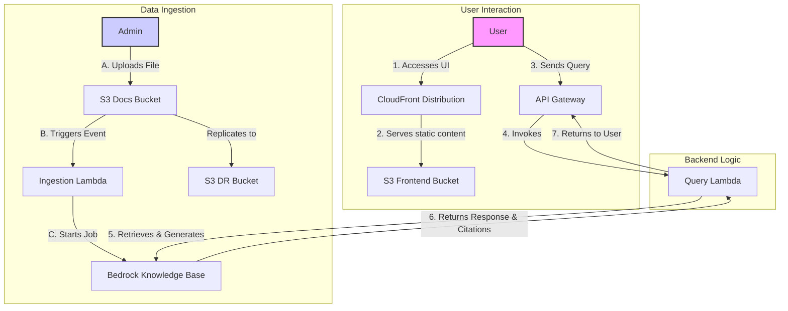

# Contextual Chatbot with Amazon Bedrock Knowledge Bases

This project provides a fully deployable, self-contained contextual chatbot application using Amazon Bedrock Knowledge Bases. It features a complete backend infrastructure defined in AWS CDK and a simple React frontend.

## Architecture

The entire application is defined as Infrastructure as Code (IaC), allowing for easy and repeatable deployments. The architecture consists of a serverless backend, a document ingestion pipeline, and a web-based frontend.



## Core Components

### 1. Frontend

- **CloudFront Distribution (`AWS::CloudFront::Distribution`):** Acts as the primary entry point for users. It serves the frontend application's static files from the S3 bucket and provides caching and HTTPS.
- **Frontend S3 Bucket (`AWS::S3::Bucket`):** A private S3 bucket that stores the built React application (HTML, CSS, JS). Access is restricted to CloudFront via Origin Access Control (OAC).

### 2. API Gateway

- **API Gateway (`AWS::ApiGateway::RestApi`):** Provides a RESTful API endpoint for the frontend to communicate with the backend. It includes throttling and usage plans for basic protection.
  - **`/docs` (POST):** The primary endpoint for submitting user queries to the chatbot.
  - **`/upload` (POST):** Generates pre-signed URLs for direct file uploads to S3.
  - **`/ingestion-status` (GET):** Returns the status of document ingestion jobs.

### 3. Backend Logic

- **Query Lambda (`AWS::Lambda::Function`):** The core of the chatbot's logic. It's invoked by the API Gateway and is responsible for:
  - Receiving the user's query.
  - Calling the Bedrock `Retrieve` API to get relevant context from the knowledge base.
  - Calling the Bedrock `InvokeModel` API with Claude 3 Sonnet to generate an answer.
  - Applying Bedrock Guardrails for content safety.
  - Returning the response, including citations, to the user.

### 4. Data Ingestion & Knowledge Base

- **Docs S3 Bucket (`AWS::S3::Bucket`):** The primary data source for the knowledge base. When a user uploads a file to this bucket, it triggers the ingestion process. It is configured with versioning for data protection.
- **Ingestion Lambda (`AWS::Lambda::Function`):** Triggered by S3 `PUT` events on the Docs S3 Bucket. This function starts an ingestion job in Bedrock, which processes the new document and adds it to the knowledge base.
- **Upload Lambda (`AWS::Lambda::Function`):** Generates pre-signed S3 URLs to allow the frontend to upload files directly to the Docs S3 Bucket without proxying through the backend.
- **Ingestion Status Lambda (`AWS::Lambda::Function`):** Polls Bedrock to check the status of ingestion jobs and reports back to the frontend.
- **Bedrock Knowledge Base (`Bedrock::VectorKnowledgeBase`):** The heart of the RAG pipeline. It automatically chunks documents into 500-token segments with 20% overlap, vectorizes them using Titan Embeddings, and stores them in a vector store for efficient retrieval.

### 5. Security & Content Safety

- **Bedrock Guardrails (`AWS::Bedrock::CfnGuardrail`):** Content filtering for harmful or inappropriate inputs and outputs. Configured with HIGH sensitivity for sexual content, violence, and hate speech, and MEDIUM for insults.
- **Model Access Check (`AWS::Lambda::Function`):** A pre-flight Lambda that validates Bedrock model access before deployment to prevent deployment failures.
- **API Usage Plan:** Throttling limits (100 req/sec rate, 200 burst) for basic API protection.

### 6. Monitoring & Observability

- **CloudWatch Alarms:** Three alarms for monitoring system health:
  - Query Lambda errors (>5 errors in 5 minutes)
  - Ingestion Lambda errors (>3 errors in 5 minutes)
  - Dead Letter Queue messages (any message appears)
- **SNS Topic (`AWS::SNS::Topic`):** Publishes alerts when alarms trigger.
- **Dead Letter Queue (`AWS::SQS::Queue`):** Captures failed ingestion events for manual review and retry.
- **X-Ray Tracing:** Enabled on all Lambda functions for distributed tracing and performance analysis.

## Deployment

The entire application can be deployed via the AWS CDK.

### Prerequisites

-   AWS CLI installed and configured with your credentials.
-   Node.js and npm installed.
-   AWS CDK installed (`npm install -g aws-cdk`).
-   Docker running on your local machine (for bundling Lambda assets).

### Steps

1.  **Clone the repository:**
    ```bash
    git clone <repository-url>
    cd <repository-name>/backend
    ```
2.  **Install dependencies:**
    ```bash
    npm install
    ```
3.  **(Optional) Bootstrap your AWS account for CDK:**
    *If you've never used CDK in this account/region before.*
    ```bash
    cdk bootstrap
    ```
4.  **Synthesize the CloudFormation Template:**
    *To review the resources that will be created.*
    ```bash
    cdk synth
    ```
5.  **Deploy the stack:**
    ```bash
    cdk deploy
    ```

After deployment, the CDK will output the URLs for the API Gateway and the CloudFront distribution.

## Usage

1.  Navigate to the **CloudFrontURL** output from the deployment.
2.  Use the interface to upload documents to the **DocsBucketName** S3 bucket.
3.  Once the documents are uploaded, the ingestion process will start automatically.
4.  You can then use the chat interface to ask questions about the documents you've uploaded.
