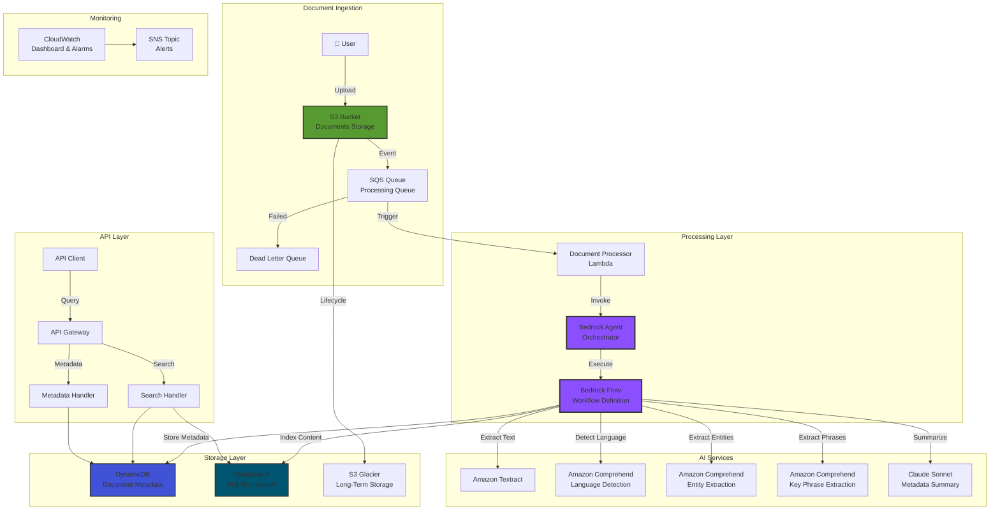

# Architecture Documentation

## System Architecture

### Overview

The Intelligent Document Processing Pipeline uses a serverless, event-driven architecture leveraging **Amazon Bedrock Agents and Flows** for efficient AI workload orchestration.

## Component Details

### 1. Document Ingestion

#### S3 Bucket
- **Purpose**: Store original documents
- **Configuration**:
  - Versioning enabled
  - Encryption at rest (S3-managed keys)
  - Lifecycle policies for cost optimization
  - Event notifications to SQS

#### SQS Processing Queue
- **Purpose**: Queue documents for parallel processing
- **Configuration**:
  - Long polling (20 seconds)
  - Visibility timeout (15 minutes)
  - Dead Letter Queue after 3 retries

### 2. Bedrock Agent & Flow

#### Bedrock Agent
- **Purpose**: Orchestrates document processing workflow
- **Responsibilities**:
  - Receives processing requests
  - Executes Bedrock Flow
  - Manages conversation state (if needed)
  - Handles errors and retries

#### Bedrock Flow
- **Purpose**: Defines the multi-step processing pipeline
- **Flow Steps**:
  1. **Input**: Receive document S3 location
  2. **Textract**: Extract text from PDF/DOCX/images
  3. **Language Detection**: Detect document language
  4. **Entity Extraction**: Extract named entities
  5. **Key Phrase Extraction**: Extract important phrases
  6. **Metadata Summarization**: Generate structured summary
  7. **Storage**: Write to DynamoDB and OpenSearch
  8. **Output**: Return processing status

### 3. AI Services Integration

#### Amazon Textract
- Extracts text from scanned documents
- Handles PDF, images, multi-page documents
- Returns structured text with layout information

#### Amazon Comprehend
- **Language Detection**: Identifies document language
- **Entity Extraction**: Extracts:
  - People (PERSON)
  - Places (LOCATION)
  - Organizations (ORG)
  - Dates, quantities, etc.
- **Key Phrase Extraction**: Identifies important phrases and topics

#### Claude (via Bedrock)
- Summarizes extracted metadata
- Structures information for storage
- Provides intelligent insights

### 4. Storage Layer

#### DynamoDB
- **Table**: `document-metadata-<region>`
- **Primary Key**: `documentId` (partition), `processingDate` (sort)
- **GSIs**:
  - `LanguageIndex`: Query by language
  - `EntityTypeIndex`: Query by entity type
- **Features**:
  - Point-in-time recovery
  - On-demand billing
  - Streams enabled (for OpenSearch sync)

#### OpenSearch
- **Index**: `documents`
- **Features**:
  - Full-text search
  - Highlighting
  - Multi-field search (content, summary, entities, phrases)
  - Fuzzy matching

#### S3 Lifecycle
1. **Standard** (0-30 days): Active access
2. **Intelligent-Tiering** (30-90 days): Automatic cost optimization
3. **Glacier** (90-365 days): Archive access
4. **Deep Archive** (365+ days): Long-term retention

### 5. API Layer

#### Search Endpoint (`/search`)
- **GET/POST**: Query documents
- **Parameters**:
  - `q`: Full-text search query
  - `language`: Filter by language
  - `entityType`: Filter by entity type
  - `limit`: Results per page
  - `offset`: Pagination offset

#### Metadata Endpoint (`/metadata/{documentId}`)
- **GET**: Retrieve document metadata
- Returns: Complete metadata including entities, phrases, summary

#### Health Endpoint (`/health`)
- **GET**: System health check
- Checks: DynamoDB connectivity, OpenSearch availability

### 6. Monitoring & Observability

#### CloudWatch Dashboard
- Processing queue depth
- Failed documents (DLQ)
- Document processing rate
- API Gateway metrics

#### CloudWatch Alarms
- **DLQ Messages**: Any message triggers alert
- **Queue Depth**: Alert at 100+ documents backlog
- **Processing Errors**: Alert on Lambda failures

#### SNS Notifications
- Email/SMS alerts for critical issues
- Configurable subscriptions

## Data Flow

### Document Processing Flow

1. **Upload**: Document uploaded to S3 bucket
2. **Event**: S3 triggers SQS message
3. **Queue**: SQS queues message for processing
4. **Trigger**: Lambda function triggered by SQS
5. **Agent**: Lambda invokes Bedrock Agent
6. **Flow**: Agent executes Bedrock Flow
7. **Processing**:
   - Flow calls Textract → Extract text
   - Flow calls Comprehend → Detect language
   - Flow calls Comprehend → Extract entities
   - Flow calls Comprehend → Extract phrases
   - Flow calls Claude → Summarize metadata
8. **Storage**:
   - Flow writes to DynamoDB
   - Flow indexes in OpenSearch
9. **Completion**: Flow returns success status
10. **Search**: Documents available via API

### Search Flow

1. **Request**: Client sends search request to API Gateway
2. **Route**: API Gateway routes to Search Lambda
3. **Query**: Lambda queries OpenSearch and/or DynamoDB
4. **Response**: Results returned to client

## Security Architecture

### Encryption
- **At Rest**: All data encrypted (S3, DynamoDB, OpenSearch)
- **In Transit**: HTTPS/TLS for all communications

### Access Control
- **IAM Roles**: Least privilege policies
- **S3**: Private bucket, no public access
- **API Gateway**: IAM authentication (can add Cognito)

### Network Security
- **OpenSearch**: Can be deployed in VPC (optional)
- **API Gateway**: Private endpoint option available

## Scalability

### Horizontal Scaling
- **SQS**: Automatically scales with message volume
- **Lambda**: Concurrent executions (configurable limit)
- **DynamoDB**: On-demand auto-scaling
- **OpenSearch**: Can scale nodes/instances

### Parallel Processing
- SQS enables parallel document processing
- Configurable Lambda concurrency limits
- Bedrock Agents handle concurrent requests

## Disaster Recovery

### Recommendations
1. **S3 Cross-Region Replication**: Replicate documents
2. **DynamoDB Global Tables**: Multi-region metadata
3. **OpenSearch Snapshots**: Regular backups
4. **S3 Versioning**: Point-in-time recovery

### RTO/RPO Targets
- **RTO**: < 1 hour (with proper DR setup)
- **RPO**: < 15 minutes (with cross-region replication)

## Cost Optimization

### Strategies Implemented
1. **S3 Lifecycle**: Automatic tier transitions
2. **DynamoDB On-Demand**: Pay per request
3. **Bedrock Pay-Per-Use**: No upfront costs
4. **Lambda**: Pay per invocation
5. **OpenSearch**: Right-sized instance type

### Estimated Costs (Moderate Usage)
- **S3 Storage**: $0.023/GB/month (Standard tier)
- **S3 Requests**: $0.005/1000 requests
- **DynamoDB**: $1.25/million requests
- **OpenSearch**: $15-50/month (t3.small)
- **Bedrock**: Pay per API call
- **Lambda**: $0.20/million requests

Total: ~$50-100/month for moderate usage (1000 documents/month, 100GB storage)

## Future Enhancements

### Planned Features
- **Multi-Region DR**: Full DR strategy implementation
- **Visualization Dashboard**: Frontend for data insights
- **Advanced Analytics**: Document analytics and reporting
- **Custom Entity Types**: Train custom entity models
- **Multi-Language Support**: Enhanced language processing

### Extensibility
- Add custom Flow steps for domain-specific processing
- Integrate additional AI services
- Custom search relevance tuning
- Advanced filtering and faceting

