# Disaster Recovery Architecture Diagram

## Multi-Region Deployment with DynamoDB Global Tables

### Mermaid Diagram (Paste into GitHub README or diagrams.net)


## Simplified DR View

```mermaid
graph LR
    subgraph "us-west-2 PRIMARY"
        A[🖥️ Active Processing]
        B[🗄️ DynamoDB<br/>Global Tables<br/>Read + Write]
        A -->|Writes| B
    end
    
    B -.->|Sub-second<br/>Replication| C
    
    subgraph "us-east-2 DR"
        C[🗄️ DynamoDB<br/>Replicas<br/>Read + Write]
        D[⏸️ Standby<br/>Deploy on Failover]
    end
    
    style A fill:#4caf50
    style B fill:#527fff
    style C fill:#527fff
    style D fill:#ccc,stroke-dasharray: 5 5
```



## Data Flow Diagram


## Failover Workflow

```mermaid
stateDiagram-v2
    [*] --> Normal: System Running
    
    Normal --> DetectFailure: us-west-2 outage detected
    DetectFailure --> Assess: Check DR region health
    
    Assess --> VerifyData: Data intact?
    
    VerifyData --> DeployDR: ✅ Data intact
    VerifyData --> RestoreData: ❌ Data corrupted
    
    RestoreData --> PointInTime: Restore from PITR
    PointInTime --> DeployDR: Data restored
    
    DeployDR --> UpdateCF: Deploy stack to us-east-2
    UpdateCF --> UpdateDNS: Update CloudFront origin
    UpdateDNS --> CreateCognito: Create new Cognito pool
    CreateCognito --> MigrateUsers: Migrate user accounts
    MigrateUsers --> ValidateSystem: Test functionality
    
    ValidateSystem --> Operational: ✅ System online
    ValidateSystem --> Troubleshoot: ❌ Issues detected
    
    Troubleshoot --> ValidateSystem: Fix and retry
    
    Operational --> Monitor: Monitor DR region
    Monitor --> Failback: us-west-2 recovered
    
    Failback --> DeployPrimary: Redeploy to us-west-2
    DeployPrimary --> SyncData: Verify data consistency
    SyncData --> UpdateCFPrimary: Revert CloudFront origin
    UpdateCFPrimary --> Normal: Resume normal operations
    
    Normal --> [*]: System stable
```



## AWS Well-Architected Framework Alignment

### Reliability Pillar

| Principle | Implementation | Status |
|-----------|---------------|--------|
| **Backup and Restore** | DynamoDB PITR (35 days), S3 versioning | ✅ |
| **Multi-AZ Deployment** | DynamoDB, Lambda, API Gateway | ✅ |
| **Multi-Region** | DynamoDB Global Tables | ✅ |
| **Change Management** | IaC (CDK), version control | ✅ |
| **Failure Monitoring** | CloudWatch, Alarms, DLQ | ✅ |
| **Automated Recovery** | Step Functions retry logic | ✅ |
| **Test Recovery** | Quarterly DR drills | 📋 Recommended |

### Performance Efficiency Pillar

| Principle | Implementation | Status |
|-----------|---------------|--------|
| **Serverless** | Lambda, DynamoDB On-Demand | ✅ |
| **Parallel Processing** | Step Functions + Lambda | ✅ |
| **Global Distribution** | CloudFront Edge Caching | ✅ |
| **Data Locality** | Regional DynamoDB replicas | ✅ |
| **Monitoring** | CloudWatch Dashboard | ✅ |

### Security Pillar

| Principle | Implementation | Status |
|-----------|---------------|--------|
| **Identity Management** | Cognito, IAM | ✅ |
| **Data Protection** | KMS encryption, TLS | ✅ |
| **Network Protection** | Private S3, API auth | ✅ |
| **Logging** | CloudWatch, CloudTrail | ✅ |
| **Deletion Protection** | DynamoDB DR tables | ✅ |

### Cost Optimization Pillar

| Principle | Implementation | Status |
|-----------|---------------|--------|
| **Right-sizing** | Lambda memory optimization | ✅ |
| **Lifecycle Management** | S3 → Glacier → Deep Archive | ✅ |
| **Duplicate Detection** | Avoid redundant processing | ✅ |
| **On-Demand Capacity** | DynamoDB auto-scaling | ✅ |

---

## Quick Start Guide for Diagram Creation

### Using draw.io (Recommended)

1. **Open draw.io**: https://app.diagrams.net/
2. **Enable AWS icon set**:
   - Click **Extras** → **Configuration**
   - Paste AWS icon library URL or search "AWS" in shape search
3. **Create new diagram**: Blank diagram
4. **Add shapes** following the architecture above:
   - Drag and drop AWS icons
   - Use rectangles for regions/subgraphs
   - Use arrows for data flow
   - Use dashed lines for replication
5. **Color coding**:
   - Blue: Primary region resources
   - Orange: DR region resources
   - Green: Active/healthy
   - Red: Alerts/DLQ
   - Gray: Standby/inactive
6. **Export**: File → Export as → PNG/SVG/PDF

### Using Mermaid (Embedded in Markdown)

The diagrams above can be embedded directly in GitHub README files. Just paste the code blocks starting with ` ```mermaid` and they'll render automatically!

### Using AWS Application Composer

1. Open AWS Console → Application Composer
2. Click **Create project**
3. Click **Template** tab
4. Paste the CloudFormation template from `cdk.out/SimplifiedDocProcessorStackV3.template.json`
5. Visual diagram will auto-generate
6. Export as PNG

---

**Pro Tip:** For presentations, use draw.io with AWS official icons. For documentation, use Mermaid (renders on GitHub automatically). For technical deep-dives, use the text-based ASCII diagrams in MULTI_REGION_ARCHITECTURE.md.

